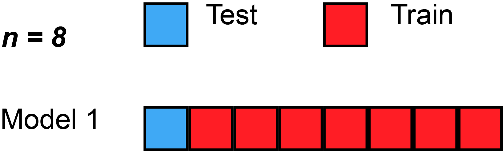
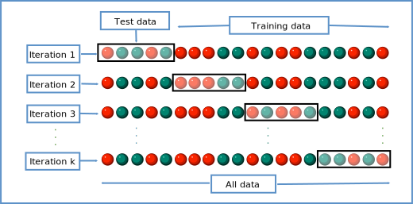

## Why cross-validation? {#cross-validation}

- **Lasso** has a tuning knob **$\lambda$**: too small → overfits; too large → underfits.
- Fitting and scoring on the **same** rows makes every $\lambda$ look artificially good.
- **Cross-validation (CV)** repeatedly **holds out** part of the data, fits on the rest, scores on the holdout, then **averages** those scores.

## The CV loop (in words)

1. Split rows into **training** and **validation** (one row for LOO, one fold for $k$-fold).
2. **`fit(model, train)`** on training rows only (for lasso: at a fixed $\lambda$).
3. **`predict(model, validation)`** on held-out rows; **score** error (MSE or deviance).
4. **Repeat** for each holdout split; **average** errors across rounds.
5. Compare averages across a **grid** of $\lambda$ values; pick the winner (or use the **1-SE rule** in `cv.glmnet`).

- This is **not** the same as a final **test set** lockbox (Tuesday): today we use CV only to **choose** $\lambda$ on the same $n$ rows we already have.

## Leave-one-out CV (LOO-CV) {#loo-cv}

- **$n$ rounds** for $n$ rows: each round holds out **exactly one** row as validation, trains on the other $n - 1$.
- **Pros:** uses almost all data each round; standard for `cv.glmnet(..., nfold = n)`.
- **Cons:** $n$ fits per $\lambda$ — slow when $n$ is large.
- **Red** = training rows; **light blue** = held-out row (**fit** → **predict** → **score**); rotate through all $n$ rounds, then **average** errors.

## LOO-CV animation

{width=70% fig-align="center"}

*Animation: [LOOCV.gif](https://commons.wikimedia.org/wiki/File:LOOCV.gif) by MBanuelos22, Wikimedia Commons, [CC BY-SA 4.0](https://creativecommons.org/licenses/by-sa/4.0/).*

## $k$-fold CV {#k-fold-cv}

- Partition rows into **$k$ folds** (often $k = 5$ or $10$). Each round, **one fold** is validation and the other $k - 1$ folds are training.
- **Pros:** only $k$ fits per $\lambda$ — faster than LOO for large $n$.
- **Cons:** slightly more variable than LOO because each fit sees fewer rows.
- **Tuesday:** `vfold_cv()` in **tidymodels** automates this for trees and other models.
- Each column below is one CV round: **fit** on training folds (dark), **predict** held-out fold (light), **score** error, then **average** across rounds.

## $k$-fold CV schematic

{width=98% fig-align="center"}

*Figure: [K-fold cross validation EN.svg](https://commons.wikimedia.org/wiki/File:K-fold_cross_validation_EN.svg) by Gufosowa, Wikimedia Commons, [CC BY-SA 4.0](https://creativecommons.org/licenses/by-sa/4.0/).*

## Lasso: pick $\lambda$ with LOO-CV {#lasso-cv}

- Try many **$\lambda$** values; for each, `cv.glmnet` averages **LOO** prediction error.
- **`lambda.min`**: lowest CV error; **`lambda.1se`**: simpler model within one standard error of the minimum (our default).
- Lab [1D](../exercises/solutions/day01-manual-kfold-cv.Rmd): manual **5-fold** loop vs `cv.glmnet` — same idea, different $k$.
