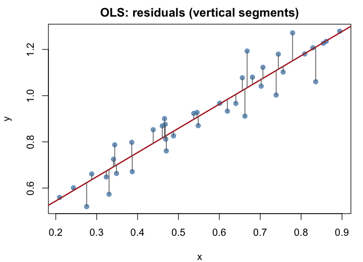

```{r}
#| label: day01-lr-intro-setup
#| include: false
suppressPackageStartupMessages({
  library(tidyverse)
  library(scatterplot3d)
})
set.seed(10201)
theme_set(theme_classic())
theme_update(
  axis.text = element_text(size = 12),
  axis.title = element_text(size = 13),
  plot.title = element_text(size = 14),
  plot.margin = margin(12, 12, 12, 12)
)
knitr::opts_chunk$set(
  message = FALSE,
  warning = FALSE,
  fig.align = "center",
  out.width = "100%",
  dpi = 120
)
```

## One explanatory variable: line + scatter

Each vertical “slice” is a Normal density centered on the **fitted line** — spread of $y$ at a given $x$.

```{r}
#| label: day01-lr-intro-line
#| echo: false
#| fig-height: 4.5
#| fig-width: 9
x <- seq(0, 12, 3)
y <- x * 0.5
df <- data.frame(x, y)

x.obs <- runif(100, 1, 10)
y.obs <- x.obs * 0.5 + rnorm(100, 0, 1)
df.obs <- data.frame(x = x.obs, y = y.obs)

curves <- lapply(seq_len(nrow(df)), function(i) {
  mu <- df$y[i]
  rng <- mu + c(-3, 3)
  seq_y <- seq(rng[1], rng[2], length.out = 100)
  data.frame(
    x = -3 * dnorm(seq_y, mean = mu) + df$x[i],
    y = seq_y,
    grp = i
  )
})
curves <- bind_rows(curves)

ggplot(df, aes(x, y)) +
  geom_point(size = 2.5) +
  geom_line(linewidth = 0.9) +
  geom_path(data = curves, aes(group = grp), color = "gray40", linewidth = 0.5) +
  geom_point(data = df.obs, aes(x, y), alpha = 0.35, size = 1.8) +
  labs(
    title = "Simple linear regression (toy data)",
    x = "Explanatory variable",
    y = "Response variable"
  )
```

## Fit the model

```{r}
#| label: day01-lr-intro-fit
#| echo: false
#| results: hide
mod_toy <- lm(y.obs ~ x.obs, data = df.obs)
```

Fitting is done by minimizing sum of squared residuals (oridnary least squares, OLS).

{#fig-my-image width=80% fig-align="center"}

## Q–Q plot of residuals

Checks whether residuals look **roughly Normal** (one assumption behind classical intervals).

```{r}
#| label: day01-lr-intro-qq
#| echo: false
#| fig-height: 4
#| fig-width: 6
ggplot(df.obs, aes(sample = residuals(mod_toy))) +
  stat_qq() +
  stat_qq_line(color = "firebrick3", linetype = "dashed", linewidth = 0.7) +
  labs(
    title = "Q–Q plot of residuals",
    x = "Theoretical quantiles",
    y = "Sample quantiles"
  ) +
  theme_minimal()
```

## Residuals vs fitted values

Look for **pattern** (curve, funnel shape) — not just random scatter around zero.

```{r}
#| label: day01-lr-intro-resid-fitted
#| echo: false
#| fig-height: 4
#| fig-width: 6
ggplot(df.obs, aes(x = fitted(mod_toy), y = residuals(mod_toy))) +
  geom_hline(yintercept = 0, linetype = "dashed", color = "gray50") +
  geom_point(color = "dodgerblue", size = 2, alpha = 0.7) +
  labs(
    title = "Residuals vs fitted",
    x = "Fitted values",
    y = "Residuals"
  ) +
  theme_minimal()
```

## Two predictors: a plane in 3D

Multiple regression with two predictors is a **plane** in $(x_1, x_2, y)$ space (more predictors → hyperplane).

```{r}
#| label: day01-lr-intro-3d-prep
#| echo: false
#| results: hide
set.seed(42)
n3 <- 100
dat3 <- data.frame(
  X1 = rnorm(n3),
  X2 = rnorm(n3)
)
dat3$Y <- 3 + 2 * dat3$X1 - dat3$X2 + rnorm(n3, sd = 1)
mod3 <- lm(Y ~ X1 + X2, data = dat3)
```

```{r}
#| label: day01-lr-intro-3d-plot
#| echo: false
#| fig-height: 5.5
#| fig-width: 6.5
#| fig-align: center
s3d <- scatterplot3d(
  dat3$X1, dat3$X2, dat3$Y,
  pch = 16,
  color = alpha("steelblue", 0.65),
  xlab = "x1",
  ylab = "x2",
  zlab = "y",
  angle = 20,
  main = "Two predictors + least-squares plane"
)
s3d$plane3d(mod3, lty = "solid", lwd = 2, col = "firebrick3")
```
