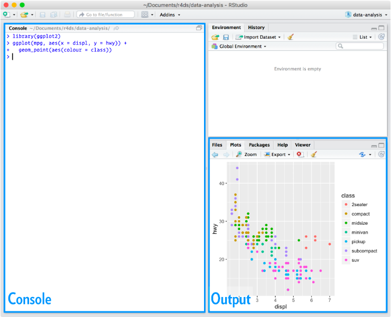

RStudio / Positron intro for Monday slides. **Packages:** `tidyverse` (base R `faithful` for a quick demo).

```{r}
#| label: day01-rstudio-setup
#| include: false
suppressPackageStartupMessages({
  library(tidyverse)
})
theme_set(theme_classic())
knitr::opts_chunk$set(
  message = FALSE,
  warning = FALSE,
  fig.align = "center",
  out.width = "100%",
  dpi = 120
)
```

## R and RStudio 

- **R** — the language: objects, functions, statistics, graphics  
- **RStudio Desktop** — a **workbench** around R (editor, console, plots, files)  
- **Positron** — Posit’s newer IDE; same habits (script → console → plots)  
- **R Project** — open the **course folder** as a project so paths and history stay in one place  

## RStudio layout (four panes)

| | |
|---|---|
| **Source / Editor** — write `.R` scripts; run lines with shortcuts | **Environment** — data frames and objects you have created |
| **Console** — type commands; see output and errors | **Files / Plots / Packages / Help** — browse files; view figures; install packages |

{#fig-my-image width=80% fig-align="center"}

## Install R, then RStudio

1. **R** from [CRAN](https://cran.r-project.org/) (or use your lab’s managed install)  
2. **RStudio Desktop** from [Posit — RStudio download](https://posit.co/download/rstudio-desktop/)  
3. Open RStudio → **Console** → check it works:

```{r}
#| label: day01-rstudio-version
#| echo: true
#| eval: false
R.version.string
```


## Scripts: save your work

- **File → New File → R Script** (or **Ctrl/Cmd + Shift + N**)  
- Put the cursor on a line → **Run** sends it to the Console:  
  - **Windows / Linux:** Ctrl + Enter  
  - **macOS:** Cmd + Enter  
- Lines starting with **`#`** are **comments** (notes for humans; R ignores them)  
- **Save** the `.R` file and re-run from the top when you change something — that is reproducibility in miniature  

## Load data: built-in table

Any rectangular table works. Here we use **`faithful`** (Old Faithful geyser eruptions) — no extra package required:

```{r}
#| label: day01-rstudio-load
#| echo: true
library(tidyverse)

faithful_df <- as_tibble(faithful)
```

**Also common in projects:** a file in your project folder, read with **`read_csv()`** from **readr** (part of tidyverse):

```r
# my_table <- read_csv("data/my_measurements.csv")
```

Paths are **relative to the project root** when you use an RStudio Project.

## First look: `glimpse()`

```{r}
#| label: day01-rstudio-glimpse
#| echo: true
glimpse(faithful_df)
```

## ggplot2 Grammar

**Data** and **aesthetic mappings** (`aes`: x, y, colour, …) +

**geometric layers** (`geom_point`, `geom_smooth`, …) + 

**`labs()`** + 

**`theme_*()`**, 

Combine different steps with **`+`** at *end of line*, new command can start in next line.

## Example plot — scatter

```{r}
#| label: day01-rstudio-plot-scatter
#| echo: true
#| fig-height: 4.5
#| fig-width: 8
ggplot(faithful_df, aes(x = eruptions, y = waiting)) +
  geom_point(alpha = 0.7, size = 2, color = "steelblue") +
  labs(
    title = "Old Faithful: eruption length vs waiting time",
    x = "Eruption duration (min)",
    y = "Waiting time (min)"
  ) +
  theme_minimal()
```

## Example plot — add a layer (`geom_smooth`)

Each **`+`** adds another layer or adjustment:

```{r}
#| label: day01-rstudio-plot-facet
#| echo: true
#| fig-height: 4.2
#| fig-width: 8
ggplot(faithful_df, aes(x = eruptions, y = waiting)) +
  geom_point(alpha = 0.6, size = 1.8, color = "gray40") +
  geom_smooth(method = "lm", se = TRUE, color = "firebrick", linewidth = 0.8) +
  labs(
    title = "Same data with a linear smooth",
    x = "Eruption duration (min)",
    y = "Waiting time (min)"
  ) +
  theme_minimal()
```

## Notebook exercise 

Open any notebook from the [notebook index](../notebooks/index.qmd) and try **Render** in RStudio.


