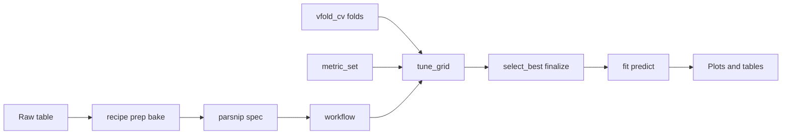

## Palmer Penguins: one table, one model family (trees)

- **Outcome `y`:** Adelie vs Gentoo (complete cases).
- **Predictors:** bill length & depth, **island**, **sex**, **year** — no flipper or body mass (so **`tree_depth`** and **`min_n`** show a real tuning tradeoff).
- **Today’s engine:** **`decision_tree()` + `rpart` only** — forests and boosting come on **Thursday**.

```{r}
#| label: day02-walk-balance
#| echo: false
#| fig-width: 7
#| fig-height: 4
plot_class_balance(peng_bal, "Balanced classes")
```

```{r}
#| label: day02-walk-scatter
#| echo: false
#| fig-width: 7
#| fig-height: 4.5
ggplot(peng_bal, aes(bill_length_mm, bill_depth_mm, color = y)) +
  geom_point(size = 2.6) +
  scale_color_manual(values = c(Adelie = "turquoise", Gentoo = "magenta")) +
  theme_minimal() +
  labs(
    title = "Bill space — Adelie vs Gentoo",
    x = "Bill length (mm)",
    y = "Bill depth (mm)"
  )
```

## The pipeline in principle

No code yet — the **shape** of every `tidymodels` project this week:



- **Recipe steps run inside each CV fold** — never scale or encode on the full table before splitting (avoids leakage).
- **`recipe` / `spec` / `workflow` are blueprints**; only **`fit()`**, **`fit_resamples()`**, and **`tune_grid()`** touch rows.
- **Today’s score:** **accuracy** only; Thursday adds metrics for imbalanced data.

## Five steps — what each one does

1. **Recipe** — declare preprocessing steps (drop useless columns, dummy-code categories, scale numerics). **`prep()`** learns rules on training rows; **`bake()`** applies them.
2. **Spec** — choose model **type**, **engine**, **mode**, and which arguments to tune. Still a **blueprint** — not fitted.
3. **Workflow** — glue **`recipe` + `spec`** so one **`fit()`** runs preprocessing and training in the right order.
4. **Metrics** — define how to judge predictions (**`accuracy`** today).
5. **Resample and tune** — search hyperparameters on **`vfold_cv`** folds, pick the best, then **`fit`** for plots and interpretation.

## Packages in the pipeline

| Package | Job |
|---------|-----|
| **`rsample`** | Training vs assessment rows (`initial_split`, `vfold_cv`) |
| **`recipes`** | Preprocessing checklist (dummy, scale, …) |
| **`parsnip`** | Model **blueprint** (`decision_tree`, `set_engine("rpart")`) |
| **`workflows`** | Glue recipe + model |
| **`tune`** | Search `tree_depth` and `min_n` |
| **`yardstick`** | Scores — **accuracy only** today; more metrics Thursday |

# Step 1 — Preprocessing (`recipe`)

Turn raw columns into a model-ready table — **in order**, and **only on training rows** inside each fold.

## Step 1 — Why a recipe?

- A **recipe** is a **checklist** of transforms applied **before** the model sees the data.
- Steps run **top to bottom**; order matters (e.g. dummy-code before scaling).
- **`prep()`** learns parameters on training data; **`bake()`** applies them — a **`workflow()`** does both automatically inside CV.

## Start the recipe

```{r}
#| label: day02-walk-rec-start
#| echo: true
#| message: false
rec <- recipe(y ~ ., data = peng_bal)
rec
```

- **`recipe(y ~ ., data = peng_bal)`** — `y` is the outcome; **`.`** = all other columns are predictors.
- Blueprint only — nothing transformed yet.

## `step_zv()` — drop zero-variance columns

```{r}
#| label: day02-walk-rec-zv
#| echo: true
#| message: false
rec <- rec |>
  step_zv(all_predictors())
rec
```

- Removes columns with one unique value (no predictive power; can break algorithms in small folds).

## `step_dummy()` — encode categories

```{r}
#| label: day02-walk-rec-dummy
#| echo: true
#| message: false
rec <- rec |>
  step_dummy(all_nominal_predictors())
rec
```

- **`island`** and **`sex`** → numeric 0/1 columns for **`rpart`**.

## `step_normalize()` — scale numeric predictors

```{r}
#| label: day02-walk-rec-norm
#| echo: true
#| message: false
rec <- rec |>
  step_normalize(all_numeric_predictors())
rec
```

- Z-score each numeric column using **training-fold rows only** inside CV.
- Good habit before you swap in other model types later in the week.

```{r}
#| label: day02-walk-rec-base-assign
#| echo: true
#| message: false
rec_base <- rec
rec_base
```

## `prep()` and `bake()` — learn rules, then apply {#prep-and-bake}

- **`prep(recipe, training = train)`** estimates each step on **training rows only**.
- **`bake(prep, new_data = ...)`** applies those rules without re-learning (train, test, or new rows).
- A **`workflow()`** runs **`prep` + `bake` + `fit`** inside each CV fold automatically.

```{r}
#| label: day02-walk-prep-bake-demo
#| echo: true
#| message: false
set.seed(2)
split_demo <- initial_split(peng_bal, prop = 0.75, strata = y)
train_demo <- training(split_demo)
test_demo <- testing(split_demo)

rec_prep <- prep(rec_base, training = train_demo)
bake_train <- bake(rec_prep, new_data = train_demo)
bake_test <- bake(rec_prep, new_data = test_demo)

dplyr::glimpse(bake_train)
```

::: {.callout-note}
## Afternoon lab (microbiome)

Same pattern on OTU counts — add **`step_mutate(..., log1p(.x))`** on skewed abundances before `step_zv`.
:::

# Step 2 — Model blueprint (`spec`)

Choose the learner and its settings — still **no fitting**.

## Step 2 — What is a spec?

- **`parsnip`** stores the **model family** and hyperparameters in a **`spec`** object.
- **`set_engine("rpart")`** picks the R implementation; **`set_mode("classification")`** matches a factor outcome.
- **`tune()`** marks arguments we will search later — the spec stays a **blueprint** until **`fit()`**.

## Classification tree with `rpart`

```{r}
#| label: day02-walk-tree-spec-fixed
#| echo: true
#| message: false
tree_spec_demo <- decision_tree(tree_depth = 4, min_n = 10) |>
  set_engine("rpart") |>
  set_mode("classification")
tree_spec_demo
```

- **`decision_tree()`** — fixed **parsnip** function name.
- **`tree_depth`**, **`min_n`** — depth limit and minimum leaf size.
- **`set_engine("rpart")`** — same engine as the gene trees this morning.
- **`set_mode("classification")`** — factor outcome **`y`**.

## Tuning knobs (`tune()`)

```{r}
#| label: day02-walk-tree-spec-tune
#| echo: true
#| message: false
tree_spec <- decision_tree(
  tree_depth = tune(),
  min_n = tune()
) |>
  set_engine("rpart") |>
  set_mode("classification")
tree_spec
```

- **`tune()`** marks arguments **`tune_grid()`** will search — we pick winners by **cross-validated accuracy**.

## Parsnip: type → engine → mode

| Model type | Valid engines (examples) | Modes |
|------------|--------------------------|-------|
| `decision_tree()` | `"rpart"`, `"C5.0"` | classification, regression |
| `rand_forest()` | `"ranger"`, `"randomForest"` | classification, regression |
| `boost_tree()` | `"xgboost"`, `"lightgbm"` | classification, regression |

Thursday swaps **`spec`** — same **`recipe`** and **`workflow()`** pattern.

```{r}
#| label: day02-walk-bad-engine
#| echo: true
#| eval: false
#| message: false
decision_tree() |>
  set_engine("lm") |>
  set_mode("classification")
# Error: 'lm' is not a valid engine for decision_tree()
```

# Step 3 — Workflow

Bundle preprocessing and model into **one** object.

## Step 3 — Bundle recipe and model

- **`workflow()`** combines **`rec_base`** and **`tree_spec`** so you never preprocess the full table before splitting.
- **`add_recipe()`** + **`add_model()`** — one object to pass to **`fit()`**, **`tune_grid()`**, or **`fit_resamples()`**.
- Inside each resample, the workflow **prep → bake → train** on analysis rows only.

## Step 3 — `workflow()` code

```{r}
#| label: day02-walk-wf
#| echo: true
#| message: false
wf <- workflow() |>
  add_recipe(rec_base) |>
  add_model(tree_spec)
wf
```

## Step 3 — One-shot fit (intuition)

- **`fit(wf, data = peng_bal)`** on **all rows** is a quick way to **see** a decision boundary — not our final honest evaluation.
- We use a **fixed** demo spec (`tree_spec_demo`) so the plot is stable before tuning.
- After tuning (Step 5), we refit on all rows for teaching plots; in a project, keep a locked **test** set.

## Step 3 — Fit and boundary (code)

```{r}
#| label: day02-walk-fit-demo
#| echo: true
#| message: false
wf_demo <- workflow() |>
  add_recipe(rec_base) |>
  add_model(tree_spec_demo)
fit_demo <- fit(wf_demo, data = peng_bal)
```

```{r}
#| label: day02-walk-boundary
#| echo: false
#| fig-width: 7
#| fig-height: 4.5
print(plot_prob_boundary(fit_demo, peng_bal, title = "Fitted tree — P(Gentoo)"))
```

# Step 4 — Metrics (accuracy today)

Decide **how** to score predictions **before** you tune.

## Step 4 — Choose a metric before tuning

- **`accuracy`** — fraction of correct class labels; fine when classes are balanced and errors cost the same.
- **Thursday:** sensitivity, ROC-AUC, PR-AUC when the positive class is rare — accuracy can mislead.
- **`metric_set(accuracy)`** bundles scorers for **`tune_grid()`** and **`fit_resamples()`**.

## Step 4 — `metric_set` code

```{r}
#| label: day02-walk-metrics
#| echo: true
#| message: false
metrics_day2
```

# Step 5 — Cross-validation and tuning

Search **`tree_depth`** and **`min_n`** on held-out folds, then finalize.

## `fit()` vs `fit_resamples()` vs `tune_grid()`

| Function | Data splits | Parameter combinations |
|----------|-------------|------------------------|
| **`fit()`** | 1 training set | 1 |
| **`fit_resamples()`** | Many folds/resamples | 1 |
| **`tune_grid()`** | Many folds/resamples | Many |

- Use **`fit()`** when hyperparameters are already chosen.
- Use **`fit_resamples()`** to estimate CV performance for one fixed workflow.
- Use **`tune_grid()`** when you need to search over multiple hyperparameter values.

**In this walkthrough:** `fit_demo` (plot), `rs_tree` (CV, fixed params), `tune_res` (CV + search).

## Step 5 — Search hyperparameters on folds

- **`folds <- vfold_cv(..., strata = y)`** — each fold keeps both species represented.
- **`tune_grid(wf, resamples = folds, grid = ..., metrics = metrics_day2)`** tries many specs; preprocessing is refit **inside** each fold.
- Grid spans **stumps** (depth 1, large `min_n`) to **more flexible** trees.

## Step 5 — `tune_grid` code

```{r}
#| label: day02-walk-tune
#| echo: true
#| message: false
set.seed(2)
tune_res <- tune_grid(
  wf,
  resamples = folds,
  grid = grid_regular(
    tree_depth(range = c(1, 6)),
    min_n(range = c(2, 50)),
    levels = 4
  ),
  metrics = metrics_day2
)
```

## Step 5 — Read the tuning plot

- **`autoplot(tune_res)`** shows mean **accuracy** vs **`tree_depth`** and **`min_n`**.
- Expect **lower accuracy** at **`tree_depth = 1`** (stump) and with **large `min_n`** (heavy pruning).
- Pick a region that balances fit and simplicity before **`select_best()`**.

## Step 5 — Tuning plot (code)

```{r}
#| label: day02-walk-autoplot
#| echo: true
#| fig-width: 10
#| fig-height: 5
tune_res |>
  autoplot() +
  theme_minimal() +
  labs(
    title = "Tuning: accuracy vs tree_depth and min_n",
    subtitle = "Bill + island + sex + year — no flipper/mass"
  )
```



## Step 5 — Finalize and refit

- **`select_best(tune_res, metric = "accuracy")`** — best hyperparameters from CV.
- **`finalize_workflow(wf, best)`** — plug tuned values into the blueprint.
- **`fit(final_wf, data = peng_cls)`** — one tree on all rows for **plots**; **`fit_resamples()`** reports honest CV performance.
- In projects, use **`last_fit()`** with a true test set instead of fitting on all rows for reporting.

## Step 5 — Finalize and CV metrics (code)

```{r}
#| label: day02-walk-finalize
#| echo: true
#| message: false
best <- select_best(tune_res, metric = "accuracy")
final_wf <- finalize_workflow(wf, best)
final_fit <- fit(final_wf, data = peng_cls)
best
```

```{r}
#| label: day02-walk-fit-resamples
#| echo: true
#| message: false
set.seed(6)
wf_tree <- final_wf
rs_tree <- fit_resamples(wf_tree, folds, metrics = metrics_day2)
metrics_summary_table(rs_tree, "Tuned tree (5-fold CV)")
```

## Fitted tree structure

```{r}
#| label: day02-walk-rpart-plot
#| echo: true
#| fig-width: 10
#| fig-height: 6
final_fit |>
  extract_fit_engine() |>
  rpart.plot(
    roundint = FALSE,
    type = 4,
    extra = 104,
    box.palette = "RdBu",
    main = "Final decision tree (rpart)"
  )
```

## Variable importance (this tree)

```{r}
#| label: day02-walk-vip
#| echo: true
#| fig-width: 9
#| fig-height: 5
final_fit |>
  extract_fit_parsnip() |>
  vip(geom = "point", aesthetics = list(color = "midnightblue", size = 3)) +
  theme_minimal() +
  labs(
    title = "Split-based importance (single tree)",
    subtitle = "Correlated bills ≠ causation — full VIP chapter on Thursday"
  )
```
