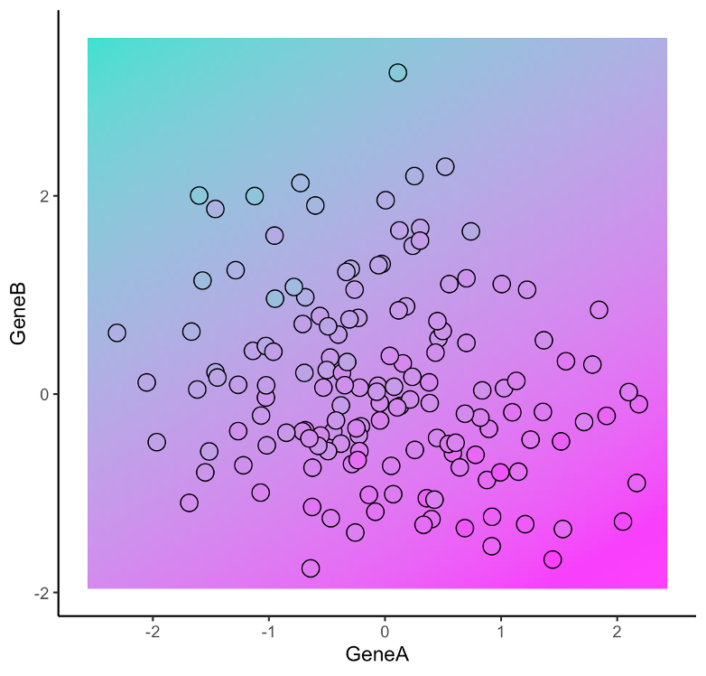
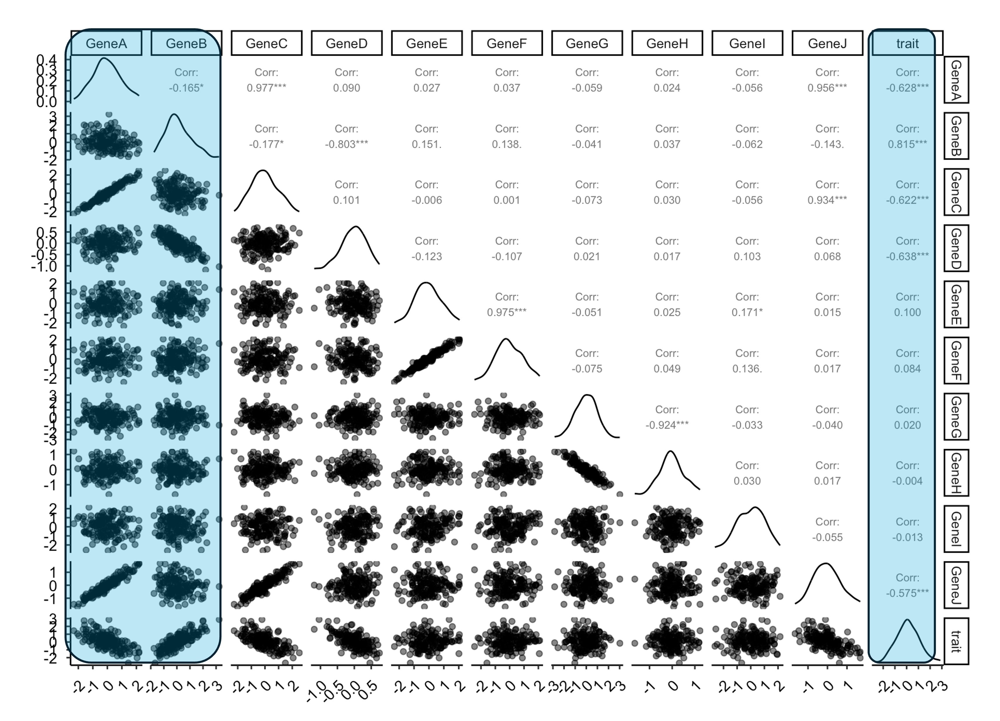
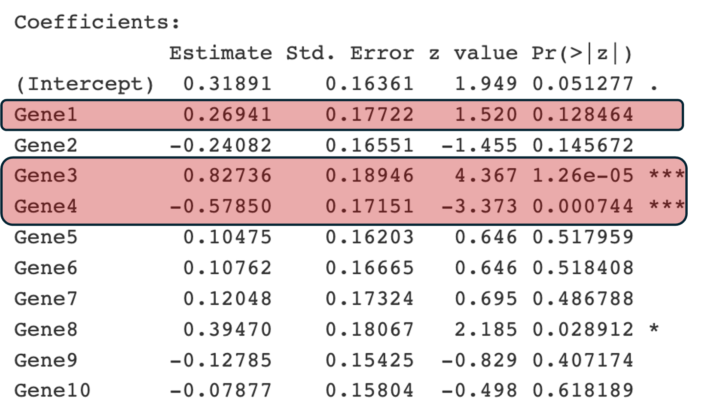
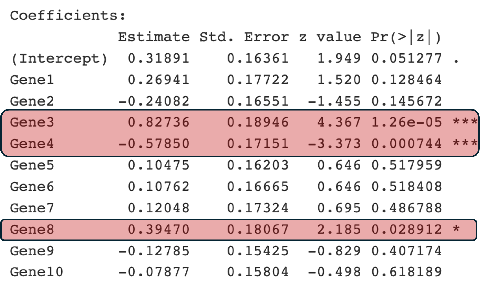

## Navigation

- [Teaching Hub](../index.qmd)
- [Curriculum Outline](../curriculum-outline.qmd)
- [Module Library](../modules/index.qmd)
- [Next: Day 2 (Tuesday) deck](day-02-tuesday.qmd)


# Part A  -  Setup

## Tools we use this week

- **R**  -  language for statistics, graphics, and reproducible scripts  
- **RStudio or Positron**  -  console, editor, projects, and **Render** for `.qmd` / `.Rmd`  
- **tidyverse**  -  shared data and plot grammar (`dplyr`, `ggplot2`, ...); you will see the pipe `|>` in notebooks  
- **tidymodels**  -  recipes, workflows, and resampling for modeling pipelines (**Tuesday onward**); **Monday** stays mostly familiar **`lm`** / **`glm`**  
- Install **`palmerpenguins`** before Tuesday  -  we use it in the penguin notebooks, not in today's gene simulations  

Details and installs: [Student notebooks](../notebooks/index.qmd) 

## Overview

- **Day 1 (Monday):** classical statistics recap; toy linear regression; **Gene × trait** and **Gene × disease** (null → full → AIC → lasso)  
- **Day 2 (Tuesday):** two cultures; decision trees; Palmer Penguins **train/test holdout** and `tidymodels` pipeline  
- **Day 3 (Wednesday):** mini symposium and social event (no lecture deck on this site)  
- **Day 4 (Thursday):** forests, boosting, neural nets; PCA / impute / upsample; interpretability and metrics  

## Learning objectives 

- Navigate **RStudio / Positron**: open a project, load a table, and make a simple **`ggplot2`** figure  
- Know **which other tools** we use this week (tidyverse, **tidymodels** from Tuesday onward)  
- Work through **two synthetic gene datasets** (continuous trait; binary disease) with known ground truth  
- See **underfitting** (intercept-only) vs **overfitting risk** (all predictors) on the **same** data  
- Use **forward and backward AIC** selection, then **lasso** as a continuous alternative  
- Explain **cross-validation** (leave-one-out and $k$-fold) for choosing tuning parameters such as lasso **$\lambda$** (`cv.glmnet`)  -  not a final test-set lockbox today  


RStudio / Positron intro for Monday slides. **Packages:** `tidyverse` (base R `faithful` for a quick demo).

```{r}
#| label: day01-rstudio-setup
#| include: false
suppressPackageStartupMessages({
  library(tidyverse)
})
theme_set(theme_classic())
knitr::opts_chunk$set(
  message = FALSE,
  warning = FALSE,
  fig.align = "center",
  out.width = "100%",
  dpi = 120
)
source("../R/slide-viz-helpers.R")
```

## R and RStudio 

- **R**  -  the language: objects, functions, statistics, graphics  
- **RStudio Desktop**  -  a **workbench** around R (editor, console, plots, files)  
- **Positron**  -  Posit's newer IDE; same habits (script → console → plots)  
- **R Project**  -  open the **course folder** as a project so paths and history stay in one place  

## RStudio layout (four panes)

| | |
|---|---|
| **Source / Editor**  -  write `.R` scripts; run lines with shortcuts | **Environment**  -  data frames and objects you have created |
| **Console**  -  type commands; see output and errors | **Files / Plots / Packages / Help**  -  browse files; view figures; install packages |

{#fig-my-image width=80% fig-align="center"}

## Install R, then RStudio

1. **R** from [CRAN](https://cran.r-project.org/) (or use your lab's managed install)  
2. **RStudio Desktop** from [Posit  -  RStudio download](https://posit.co/download/rstudio-desktop/)  
3. Open RStudio → **Console** → check it works:

```{r}
#| label: day01-rstudio-version
#| echo: true
#| eval: false
R.version.string
```


## Scripts: save your work

- **File → New File → R Script** (or **Ctrl/Cmd + Shift + N**)  
- Put the cursor on a line → **Run** sends it to the Console:  
  - **Windows / Linux:** Ctrl + Enter  
  - **macOS:** Cmd + Enter  
- Lines starting with **`#`** are **comments** (notes for humans; R ignores them)  
- **Save** the `.R` file and re-run from the top when you change something  -  that is reproducibility in miniature  

## Old Faithful  -  our ggplot demo data

The built-in **`faithful`** table records **eruption duration** and **waiting time** between eruptions at Yellowstone (minutes). [Data card](../data/cards/old-faithful.qmd)

{width=72% fig-align="center"}

*Photo: Old Faithful geyser, Yellowstone (Wikimedia Commons, CC BY-SA 4.0).*

## Load data: built-in table

Any rectangular table works. Here we use **`faithful`**  -  no extra package required:

```{r}
#| label: day01-rstudio-load
#| echo: true
library(tidyverse)

faithful_df <- as_tibble(faithful)
```

**Also common in projects:** a file in your project folder, read with **`read_csv()`** from **readr** (part of tidyverse):

```r
# my_table <- read_csv("data/my_measurements.csv")
```

Paths are **relative to the project root** when you use an RStudio Project.

## First look: `glimpse()`

```{r}
#| label: day01-rstudio-glimpse
#| echo: true
glimpse(faithful_df)
```

## ggplot2 Grammar

**Data** and **aesthetic mappings** (`aes`: x, y, colour, ...) +

**geometric layers** (`geom_point`, `geom_smooth`, ...) + 

**`labs()`** + 

**`theme_*()`**, 

Combine different steps with **`+`** at *end of line*, new command can start in next line.

## Example plot  -  scatter

```{r}
#| label: day01-rstudio-plot-scatter
#| echo: true
#| fig-height: 4.5
#| fig-width: 8
ggplot(faithful_df, aes(x = eruptions, y = waiting)) +
  geom_point(alpha = 0.7, size = 2, color = "steelblue") +
  labs(
    title = "Old Faithful: eruption length vs waiting time",
    x = "Eruption duration (min)",
    y = "Waiting time (min)"
  ) +
  theme_minimal()
```

## Example plot  -  add a layer (`geom_smooth`)

Each **`+`** adds another layer or adjustment:

```{r}
#| label: day01-rstudio-plot-facet
#| echo: true
#| fig-height: 4.2
#| fig-width: 8
ggplot(faithful_df, aes(x = eruptions, y = waiting)) +
  geom_point(alpha = 0.6, size = 1.8, color = "gray40") +
  geom_smooth(method = "lm", se = TRUE, color = "firebrick", linewidth = 0.8) +
  labs(
    title = "Same data with a linear smooth",
    x = "Eruption duration (min)",
    y = "Waiting time (min)"
  ) +
  theme_minimal()
```

## Notebook exercise 

Open any notebook from the [notebook index](../notebooks/index.qmd) and try **Render** in RStudio.


# Part B  -  Classical linear models

## Classical statistics 

- Data are **noisy**; models are **simplifying mathematical statements** about patterns, not automatic truths about biology  
- We **estimate** unknown quantities and (when the design supports it) quantify **uncertainty** (standard errors, intervals)  

- **Association** $\neq$ **causation**  -  a significant coefficient is still conditional on everything else in the model and on what was actually measured  

## Classical vs predictive wording 

- **Classical question:** Given a regression model, what do we learn about the slope $\beta_j$, and how fragile is it? 
- Answer is usually an estimate plus a confidence intervall.
- **Prediction question:** If we freeze this fitted equation, how well does it score on **new** data points? 
- Answer is usually a model and its performance on new unseen data.

- **Today:** all models are fit and compared on the **same** simulated samples; **Tuesday** introduces **held-out** evaluation (i.e., on new, unseen data)

## Multiple linear regression 

- **Outcome** $y$; 
- **predictors** $x_1, \ldots, x_p$  
- **Linear model:** 
$\mathbb{E}(y \mid X) = \beta_0 + \beta_1 x_1 + \cdots + \beta_p x_p$ 

additivity in the **chosen** predictor columns 

## Key assumptions 

- **Mean structure:** if the truth is a non-linear pattern, a single plane leaves **patterned residuals**  -  check the **residuals vs fitted** slide above  
- **Independent measurements**: violated by repeated measures, batches, or spatial proximity  -  then naive confidence intervals become inaccurate 
- **Comparable error spread** across fitted values (heteroscedasticity $\Rightarrow$ cautious intervals)  
- **Roughly normal errors**  -  check the **Q-Q** plot; matters most for **small-$n$** confidence intervals  
- **Influence:** a handful of extreme points can **pull** slopes  -  always look at diagnostics before you tell a story 


```{r}
#| label: day01-lr-intro-setup
#| include: false
suppressPackageStartupMessages({
  library(tidyverse)
  library(scatterplot3d)
})
set.seed(10201)
theme_set(theme_classic())
theme_update(
  axis.text = element_text(size = 12),
  axis.title = element_text(size = 13),
  plot.title = element_text(size = 14),
  plot.margin = margin(12, 12, 12, 12)
)
knitr::opts_chunk$set(
  message = FALSE,
  warning = FALSE,
  fig.align = "center",
  out.width = "100%",
  dpi = 120
)
```

## One explanatory variable: line + scatter

Each vertical "slice" is a Normal density centered on the **fitted line**  -  spread of $y$ at a given $x$.

```{r}
#| label: day01-lr-intro-line
#| echo: false
#| fig-height: 4.5
#| fig-width: 9
x <- seq(0, 12, 3)
y <- x * 0.5
df <- data.frame(x, y)

x.obs <- runif(100, 1, 10)
y.obs <- x.obs * 0.5 + rnorm(100, 0, 1)
df.obs <- data.frame(x = x.obs, y = y.obs)

curves <- lapply(seq_len(nrow(df)), function(i) {
  mu <- df$y[i]
  rng <- mu + c(-3, 3)
  seq_y <- seq(rng[1], rng[2], length.out = 100)
  data.frame(
    x = -3 * dnorm(seq_y, mean = mu) + df$x[i],
    y = seq_y,
    grp = i
  )
})
curves <- bind_rows(curves)

ggplot(df, aes(x, y)) +
  geom_point(size = 2.5) +
  geom_line(linewidth = 0.9) +
  geom_path(data = curves, aes(group = grp), color = "gray40", linewidth = 0.5) +
  geom_point(data = df.obs, aes(x, y), alpha = 0.35, size = 1.8) +
  labs(
    title = "Simple linear regression (toy data)",
    x = "Explanatory variable",
    y = "Response variable"
  )
```

## Fit the model

```{r}
#| label: day01-lr-intro-fit
#| echo: false
#| results: hide
mod_toy <- lm(y.obs ~ x.obs, data = df.obs)
```

Fitting is done by minimizing sum of squared residuals (oridnary least squares, OLS).

{#fig-my-image width=80% fig-align="center"}

## Q-Q plot of residuals

Checks whether residuals look **roughly Normal** (one assumption behind classical intervals).

```{r}
#| label: day01-lr-intro-qq
#| echo: false
#| fig-height: 4
#| fig-width: 6
ggplot(df.obs, aes(sample = residuals(mod_toy))) +
  stat_qq() +
  stat_qq_line(color = "firebrick3", linetype = "dashed", linewidth = 0.7) +
  labs(
    title = "Q-Q plot of residuals",
    x = "Theoretical quantiles",
    y = "Sample quantiles"
  ) +
  theme_minimal()
```

## Residuals vs fitted values

Look for **pattern** (curve, funnel shape)  -  not just random scatter around zero.

```{r}
#| label: day01-lr-intro-resid-fitted
#| echo: false
#| fig-height: 4
#| fig-width: 6
ggplot(df.obs, aes(x = fitted(mod_toy), y = residuals(mod_toy))) +
  geom_hline(yintercept = 0, linetype = "dashed", color = "gray50") +
  geom_point(color = "dodgerblue", size = 2, alpha = 0.7) +
  labs(
    title = "Residuals vs fitted",
    x = "Fitted values",
    y = "Residuals"
  ) +
  theme_minimal()
```

## Two predictors: a plane in 3D

Multiple regression with two predictors is a **plane** in $(x_1, x_2, y)$ space (more predictors → hyperplane).

```{r}
#| label: day01-lr-intro-3d-prep
#| echo: false
#| results: hide
set.seed(42)
n3 <- 100
dat3 <- data.frame(
  X1 = rnorm(n3),
  X2 = rnorm(n3)
)
dat3$Y <- 3 + 2 * dat3$X1 - dat3$X2 + rnorm(n3, sd = 1)
mod3 <- lm(Y ~ X1 + X2, data = dat3)
```

```{r}
#| label: day01-lr-intro-3d-plot
#| echo: false
#| fig-height: 5.5
#| fig-width: 6.5
#| fig-align: center
s3d <- scatterplot3d(
  dat3$X1, dat3$X2, dat3$Y,
  pch = 16,
  color = alpha("steelblue", 0.65),
  xlab = "x1",
  ylab = "x2",
  zlab = "y",
  angle = 20,
  main = "Two predictors + least-squares plane"
)
s3d$plane3d(mod3, lty = "solid", lwd = 2, col = "firebrick3")
```


## The meaning of regression coefficeints $\hat{\beta}_j$ 

- Each slope is **"holding other predictors constant"**  -  interpretable only in that mathematical sense, not as a controlled experiment unless design matches  
- **Correlated predictors** inflate standard errors and swap signs of coefficients easily  -  **regularization** (lasso, later today) is one way to handle such data   
- **Many predictors, modest $n$:** plain ordinary least sqaures (OLS) is unstable or non-unique 


```{r}
#| label: day01-hald-setup
#| include: false
suppressPackageStartupMessages({
  library(MASS)
  library(dplyr)
  library(tidyr)
  library(ggplot2)
  library(broom)
})
data(cement)
hald <- cement
hald_scaled <- hald
hald_scaled[, c("x1", "x2", "x3", "x4")] <- scale(hald[, c("x1", "x2", "x3", "x4")])
knitr::opts_chunk$set(
  message = FALSE,
  warning = FALSE,
  fig.align = "center",
  out.width = "100%",
  dpi = 120
)
theme_set(theme_classic())
```

## The data (`MASS::cement`)

[Data card](../data/cards/hald-cement.qmd)

```{r}
#| label: day01-hald-table
#| echo: false
knitr::kable(head(hald, 5), digits = 1, caption = "Hald cement (first 5 of 13 rows)") 
```

- **Outcome `y`:** heat evolved (calories per gram cement)  -  left on the original scale  
- **Predictors `x1`-`x4`:** oxide composition  -  we **standardize** them (`scale()`) so slopes are comparable and units do not dominate the fit  

## Standardize predictors first

```{r}
#| label: day01-hald-scale-note
#| echo: true
hald_scaled[, c("x1", "x2", "x3", "x4")] <- scale(hald[, c("x1", "x2", "x3", "x4")])
# All regressions below use hald_scaled (z-scored x1-x4, original y)
```

- Each $\hat\beta_j$ is the change in **y** (heat) per **1 SD** increase in $x_j$, holding other predictors fixed  
- Correlations among predictors are unchanged by scaling  -  but coefficient tables are easier to read

## One predictor at a time vs all four together

```{r}
#| label: day01-hald-simple-vs-full
#| echo: false
simple_slopes <- bind_rows(lapply(c("x1", "x2", "x3", "x4"), function(v) {
  m <- lm(as.formula(paste("y ~", v)), data = hald_scaled)
  tidy(m) |> filter(term != "(Intercept)")
})) |>
  transmute(predictor = term, simple_estimate = estimate, simple_p = p.value)

full_fit <- lm(y ~ x1 + x2 + x3 + x4, data = hald_scaled)
full_slopes <- tidy(full_fit) |>
  filter(term != "(Intercept)") |>
  transmute(predictor = term, full_estimate = estimate, full_p = p.value)

compare_tbl <- left_join(simple_slopes, full_slopes, by = "predictor") |>
  mutate(
    simple_sig = ifelse(simple_p < 0.05, "yes", "no"),
    full_sig = ifelse(full_p < 0.05, "yes", "no")
  )

knitr::kable(compare_tbl, digits = 6,
  caption = "Simple vs four-predictor model (scaled predictors)")
```

- **Simple** fits: **x1**, **x2**, **x4** significant; **x3** borderline  
- **All four together:** **no** predictor significant at $\alpha = 0.05$ (x1 borderline)  -  joint inference breaks down when columns overlap

```{r}
#| label: day01-hald-full-summary
#| echo: false
tidy(full_fit) |>
  mutate(across(c(estimate, std.error, statistic, p.value), \(x) round(x, 4))) |>
  knitr::kable(caption = "Four-predictor model (scaled predictors)")
```

<!-- ## Two predictors  -  `y ~ x1 + x2` -->

<!-- ```{r} -->
<!-- #| label: day01-hald-x1x2 -->
<!-- #| echo: false -->
<!-- fit_x1x2 <- lm(y ~ x1 + x2, data = hald_scaled) -->
<!-- tidy(fit_x1x2) |> -->
<!--   mutate(across(c(estimate, std.error, statistic, p.value), \(x) round(x, 4))) |> -->
<!--   knitr::kable(caption = "Two-predictor model (scaled predictors)") -->
<!-- ``` -->

<!-- - **Both x1 and x2** significant and **positive** (heat increases with each oxide, holding the other fixed) -->

## Correlations among `x1`-`x4`

```{r}
#| label: day01-hald-corr-plot
#| echo: false
#| fig-height: 4.5
#| fig-width: 5.5
hald_cor <- cor(hald_scaled[, c("x1", "x2", "x3", "x4")])
cor_long <- as.data.frame(as.table(hald_cor)) |>
  rename(var1 = Var1, var2 = Var2, r = Freq)

ggplot(cor_long, aes(var1, var2, fill = r)) +
  geom_tile(color = "white") +
  geom_text(aes(label = sprintf("%.2f", r)), size = 3.5) +
  scale_fill_gradient2(low = "#2166ac", mid = "white", high = "#b2182b", midpoint = 0, limits = c(-1, 1)) +
  coord_fixed() +
  labs(title = "Predictor correlations (Hald cement)", x = NULL, y = NULL, fill = "r")
```

Strong negative pairs: **x2-x4** ($r \approx -0.97$), **x1-x3** ($r \approx -0.82$). **x3-x4** are nearly uncorrelated ($r \approx 0.03$); **x1-x4** weakly negative ($r \approx -0.25$).

<!-- ## Quiz  -  predict the fit before you run it -->

<!-- Use the **scaled-predictor** fits above and the correlation plot. For each model, which statement best describes **significance at $\alpha = 0.05$** and the **signs** of the coefficients? -->

<!-- ## Question 1  -  `y ~ x1 + x3` -->

<!-- - A. Both x1 and x3 significant; **same** sign   -->
<!-- - B. Both significant; **opposite** signs   -->
<!-- - C. Only x1 significant   -->
<!-- - D. Only x3 significant   -->
<!-- - E. Neither significant   -->

<!-- ## Question 1  -  answer -->

<!-- **C**  -  only **x1** significant (positive); x3 not ($r_{1,3} \approx -0.82$ makes the pair unstable, but x1 retains a clear partial effect here). -->

<!-- ## Question 2  -  `y ~ x3 + x4` -->

<!-- - A. Neither significant   -->
<!-- - B. Both significant; same (negative) sign   -->
<!-- - C. Both significant; opposite signs   -->
<!-- - D. Only x3 significant   -->
<!-- - E. Only x4 significant   -->

<!-- ## Question 2  -  answer -->

<!-- **B**  -  both significant and **negative** ($\hat\beta_3 \approx -7.7$, $\hat\beta_4 \approx -12.1$) even though x3 and x4 are almost uncorrelated in this sample. -->

<!-- ## Question 3  -  `y ~ x1 + x4` -->

<!-- - A. Neither significant   -->
<!-- - B. Both significant; **same** sign   -->
<!-- - C. Both significant; opposite signs (x1 positive, x4 negative) -->
<!-- - D. Only x1 significant   -->
<!-- - E. Only x4 significant   -->

<!-- ## Question 3  -  answer -->

<!-- **C**  -  both significant; **x1 positive**, **x4 negative** ($\hat\beta_1 \approx 8.5$, $\hat\beta_4 \approx -10.3$). -->

## Takeaway 
- Multiple linear regression is not the same as multiple simple lineaer regressions

- Signs and p-values can **flip** when you add or drop correlated columns 

- Which is the "correct" model?

- Later today: **lasso** and **AIC** help navigate this kind of data


# Part C  -  Gene Expression (continuous response variable) {#part-c-gene-trait}

## A synthetic dataset 
- We use a synthetic dataset for illustrative purposes. This has the advantage that we know exactly what's going on.
- In this simulated dataset, GeneA and GeneB are genes that directly influence a specific biological trait.
- GeneC and GeneD are noise genes that are correlated with the trait but do not contribute causally. 
- GeneJ is in strongly correlated to GeneA but not causally linked to the trait. 
- Other genes act as irrelevant noise variables or have correlations among themselves.
- triat = −0.5 ∗ GeneA + 0.8 ∗ GeneB + N(0,0.3)
- more details: [Linear regression + LASSO (genes)](../notebooks/linear-regression-lasso.Rmd)


## Illustration of data and linear model
- Points: simulated data
- Color gradient: ground truth expectation without noise
{#fig-my-image width=40% fig-align="center"}

## Pairwise Plots

Distribtuion of explanatory variables (gene expression levels) and response variable (quantitative trait)

{#fig-my-image width=60% fig-align="center"}


## Overfitting vs underfitting

- **Underfitting:** model too simple  -  high error even on data used to fit (e.g. intercept-only, ignores genes)  
- **Overfitting risk:** model very flexible  -  can fit noise; unstable coefficients when predictors overlap  

- **Null model** (`trait ~ 1`): one parameter, ignores all genes → underfitting  
- **Full model** (`trait ~ .`): all genes → lower training error, but many correlated predictors → shaky $\hat{\beta}_j$  
- **Goal:** find a complexity level that balances fit and stability  


```{r}
#| label: day01-trait-libs
#| include: false
suppressPackageStartupMessages({
  library(broom)
  library(glmnet)
  library(recipes)
  library(dplyr)
  library(ggplot2)
  library(GGally)
  library(MASS)
  library(rcartocolor)
  library(tidyr)
})
my_pal <- carto_pal(12, "Bold")
theme_set(theme_classic())
knitr::opts_chunk$set(
  message = FALSE,
  warning = FALSE,
  fig.align = "center",
  out.width = "100%",
  dpi = 120
)
```

## Gene × trait: the dataset


```{r}
#| label: day01-linear-sim-data
#| echo: false
#| results: hide
set.seed(420)
n <- 150
p <- 10
gene_names <- c("GeneA", "GeneB", "GeneC", "GeneD", "GeneE", "GeneF", "GeneG", "GeneH", "GeneI", "GeneJ")
gene_data <- matrix(rnorm(n * p), nrow = n)
colnames(gene_data) <- gene_names
trait <- -0.5 * gene_data[, "GeneA"] + 0.8 * gene_data[, "GeneB"] + rnorm(n, sd = 0.3)
gene_data[, "GeneC"] <- gene_data[, "GeneA"] + rnorm(n, sd = 0.2)
gene_data[, "GeneD"] <- -0.3 * gene_data[, "GeneB"] + rnorm(n, sd = 0.2)
for (i in 5:p) gene_data[, gene_names[i]] <- rnorm(n)
gene_data[, "GeneF"] <- gene_data[, "GeneE"] + rnorm(n, sd = 0.2)
gene_data[, "GeneH"] <- -0.5 * gene_data[, "GeneG"] + rnorm(n, sd = 0.2)
gene_data[, "GeneJ"] <- 0.7 * gene_data[, "GeneA"] + rnorm(n, sd = 0.2)
data_trait <- as.data.frame(cbind(gene_data, trait))
```

```{r}
#| label: day01-correlation-heatmap
#| echo: false
#| fig-height: 4.5
#| fig-width: 8
correlation_matrix <- cor(data_trait)
cor_data <- as.data.frame(as.table(correlation_matrix)) |>
  dplyr::rename(variable1 = Var1, variable2 = Var2, correlation = Freq)
ggplot(cor_data, aes(variable1, variable2, fill = correlation)) +
  geom_tile(color = "white") +
  scale_fill_gradient2(
    low = "dodgerblue", high = "firebrick4", mid = "white",
    midpoint = 0, limit = c(-1, 1), name = "r"
  ) +
  theme_minimal() +
  theme(axis.text.x = element_text(angle = 45, hjust = 1)) +
  coord_fixed() +
  labs(title = "Correlation among genes and trait")
```

```{r}
#| label: day01-ggpairs-snippet
#| echo: false
#| fig-height: 5.5
#| fig-width: 8
ggpairs(
  data_trait,
  upper = list(continuous = wrap("cor", size = 2.2)),
  aes(alpha = 0.15)
) +
  theme(axis.text.x = element_text(angle = 45, hjust = 1))
```

## GeneA × GeneB  -  ground-truth surface

```{r}
#| label: day01-trait-surface-hero
#| echo: false
#| fig-width: 9
#| fig-height: 6
#| out-width: 100%
geneA_values <- seq(-3.5, 3.5, length.out = 100)
geneB_values <- seq(-3.5, 3.5, length.out = 100)
grid_truth <- expand.grid(GeneA = geneA_values, GeneB = geneB_values)
grid_truth$truth <- -0.5 * grid_truth$GeneA + 0.8 * grid_truth$GeneB
trait_df <- data.frame(
  GeneA = gene_data[, "GeneA"],
  GeneB = gene_data[, "GeneB"],
  trait = trait
)
ggplot() +
  geom_raster(
    data = grid_truth,
    aes(GeneA, GeneB, fill = truth),
    interpolate = TRUE
  ) +
  geom_point(
    data = trait_df,
    aes(GeneA, GeneB),
    color = "black",
    size = 2.2,
    alpha = 0.75
  ) +
  scale_fill_gradient2(low = "turquoise", mid = "white", high = "magenta", midpoint = 0) +
  theme_minimal(base_size = 14) +
  labs(
    title = "Known generating surface: trait = −0.5·GeneA + 0.8·GeneB + noise",
    x = "GeneA",
    y = "GeneB",
    fill = "E(trait)"
  )
```

```{r}
#| label: day01-trait-prep-full
#| echo: false
#| results: hide
rec_scale <- recipe(trait ~ ., data = data_trait) |>
  step_normalize(all_numeric_predictors())
data_scaled <- bake(prep(rec_scale, data_trait), data_trait)
X_s <- as.matrix(dplyr::select(data_scaled, -trait))
y <- data_scaled$trait
n_obs <- nrow(data_scaled)
```

## Null model (intercept only)

Too simple: ignores genes → **underfitting**.

```{r}
#| label: day01-lm-null
#| echo: false
#| results: hide
null_lm <- lm(trait ~ 1, data = data_scaled)
```

```{r}
#| label: day01-lm-null-table
#| echo: false
#| results: asis
broom::tidy(null_lm) |>
  mutate(across(c(estimate, std.error, statistic, p.value), \(x) round(x, 4))) |>
  knitr::kable(caption = "Null model: intercept only (scaled trait)")
```

Single intercept; no gene effects in the model.

## Full model (all genes)

Every gene in the model  -  flexible, but many correlated predictors → unstable coefficients (**overfitting risk**).

```{r}
#| label: day01-lm-full
#| echo: false
#| results: hide
full_lm <- lm(trait ~ ., data = data_scaled)
summary(full_lm)
```


```{r}
#| label: day01-lm-coef-plot
#| echo: false
#| fig-height: 4.2
#| fig-width: 8
cf <- coef(full_lm)
cf <- cf[names(cf) != "(Intercept)"]
ci <- tryCatch(
  confint(full_lm, parm = names(cf)),
  error = function(e) matrix(NA_real_, length(cf), 2, dimnames = list(names(cf), c("2.5 %", "97.5 %")))
)
coef_tbl <- data.frame(
  gene = names(cf),
  estimate = as.numeric(cf),
  lo = as.numeric(ci[, 1]),
  hi = as.numeric(ci[, 2])
)
ggplot(coef_tbl, aes(x = estimate, y = reorder(gene, estimate))) +
  geom_vline(xintercept = 0, linetype = 2, color = "gray50") +
  geom_pointrange(aes(xmin = lo, xmax = hi), fatten = 3) +
  labs(
    title = "OLS coefficients ± 95% CI (all predictors)",
    x = "Effect on trait (scaled gene units)", y = NULL
  ) +
  theme_minimal()
```

## Discrete complexity control: AIC stepwise search

- **AIC** trades log-likelihood against model size: $\mathrm{AIC} = 2k - 2\log L$. Lower is better on the *same* data.  
- **Backward** starts at the full model and drops terms if AIC improves.  
- **Forward** starts at the intercept-only model and adds terms greedily up to the full model.  


- [Linear regression + LASSO (genes)](../notebooks/linear-regression-lasso.Rmd)


## Null vs full: in-sample fit

```{r}
#| label: day01-null-vs-full-complexity
#| echo: false
#| fig-height: 3.5
#| fig-width: 6.5
cmp_tbl <- data.frame(
  model = c("Null (intercept only)", "Full (all genes)"),
  AIC = c(AIC(null_lm), AIC(full_lm)),
  RMSE_in = c(
    sqrt(mean(residuals(null_lm)^2)),
    sqrt(mean(residuals(full_lm)^2))
  )
)
ggplot(cmp_tbl, aes(x = reorder(model, -RMSE_in), y = RMSE_in, fill = model)) +
  geom_col(show.legend = FALSE) +
  coord_flip() +
  labs(
    title = "In-sample RMSE: too few vs too many predictors",
    subtitle = "Null underfits; full fits training data tighter (more parameters)",
    x = NULL, y = "RMSE (same n samples)"
  ) +
  theme_minimal()
```

## AIC: backward and forward selection

```{r}
#| label: day01-step-aic
#| echo: false
#| results: hide
backward_model <- stepAIC(full_lm, direction = "backward", trace = FALSE)
forward_model <- stepAIC(
  null_lm,
  direction = "forward",
  scope = list(lower = null_lm, upper = full_lm),
  trace = FALSE
)
```

```{r}
#| label: day01-aic-model-sizes
#| echo: false
#| fig-height: 3.2
#| fig-width: 6.5
aic_tbl <- data.frame(
  approach = c("Null", "OLS full", "AIC backward", "AIC forward"),
  n_terms = c(
    length(coef(null_lm)),
    length(coef(full_lm)),
    length(coef(backward_model)),
    length(coef(forward_model))
  ),
  AIC = c(AIC(null_lm), AIC(full_lm), AIC(backward_model), AIC(forward_model))
)
ggplot(aic_tbl, aes(x = reorder(approach, AIC), y = AIC, fill = approach)) +
  geom_col(show.legend = FALSE) +
  coord_flip() +
  labs(title = "AIC across models (same data)", x = NULL, y = "AIC (lower is better)") +
  theme_minimal()
```

```{r}
#| label: day01-aic-terms-text
#| echo: false
#| results: asis
fmt_f <- function(f) paste(deparse(f), collapse = " ")
cat("**Backward AIC formula:** `", fmt_f(formula(backward_model)), "`\n\n", sep = "")
cat("**Forward AIC formula:** `", fmt_f(formula(forward_model)), "`\n\n", sep = "")
```

## AIC vs full OLS: coefficients (±2 SE)

Dashed lines: known effects for **GeneB** (0.8) and **GeneA** (−0.5).

```{r}
#| label: day01-aic-coef-compare
#| echo: false
#| fig-height: 4.5
#| fig-width: 9
eff_plot <- bind_rows(
  broom::tidy(backward_model) %>% mutate(model = "Backward"),
  broom::tidy(forward_model) %>% mutate(model = "Forward"),
  broom::tidy(full_lm) %>% mutate(model = "Full")
) %>%
  filter(term != "(Intercept)")

ggplot(eff_plot, aes(x = estimate, y = term, color = model)) +
  geom_point(size = 2) +
  geom_errorbar(
    aes(xmin = estimate - 2 * std.error, xmax = estimate + 2 * std.error),
    width = 0.15,
    linewidth = 0.5
  ) +
  geom_vline(xintercept = c(0.8, -0.5), linetype = "dashed", color = "gray45") +
  geom_vline(xintercept = 0, linetype = "dotted", color = "gray70") +
  coord_flip() +
  scale_color_manual(values = my_pal[c(1, 4, 8)]) +
  labs(
    title = "Coefficient estimates: full vs AIC backward vs AIC forward",
    x = "Estimate (scaled gene units)", y = NULL, color = NULL
  ) +
  theme_minimal()
```


## Lasso as an alternative to discrete search {#lasso-regression}

- **Idea:** penalize large coefficients: lasso adds $\lambda \sum_j |\beta_j|$ penalty to OLS  
- **$\lambda$** controls strength: larger $\lambda$ $\Rightarrow$ simpler model (more shrinkage toward zero)  
- **Discrete AIC** picks variables in or out; **lasso** shrinks many coefficients toward **exactly zero** as $\lambda$ grows  
- **How to choose $\lambda$?** Cross-validation on the next slides  -  then `cv.glmnet` and the CV error curve



```{r}
#| label: day01-lasso-cv
#| echo: false
#| results: hide
lam_seq <- 10^seq(-3, -0.1, length.out = 25)
cv_lasso <- cv.glmnet(X_s, y, alpha = 1, lambda = lam_seq, nfold = n_obs)
best_lam <- cv_lasso$lambda.1se
lasso_fit <- glmnet(X_s, y, alpha = 1, lambda = best_lam)
```

## Lasso: CV error vs $\lambda$ (from `cv.glmnet`)

```{r}
#| label: day01-lasso-cv-plot
#| echo: false
#| fig-height: 4
#| fig-width: 6.5
plot(cv_lasso)
```

## Lasso coefficient paths

```{r}
#| label: day01-lasso-coef-path
#| echo: false
#| fig-height: 4.2
#| fig-width: 7
fit_lasso_path <- glmnet(X_s, y, alpha = 1, lambda = lam_seq)
plot(fit_lasso_path, xvar = "lambda", label = TRUE)
```

## Summary: all approaches (in-sample, same data)

In-sample comparison on all $n$ samples. 

```{r}
#| label: day01-trait-summary-table
#| echo: false
#| results: asis
pred_lasso <- as.numeric(predict(lasso_fit, newx = X_s))
trait_r2_in <- function(model, pred) {
  if (inherits(model, "lm")) {
    return(summary(model)$r.squared)
  }
  if (sd(pred) < .Machine$double.eps) {
    return(0)
  }
  cor(y, pred)^2
}
trait_summary_row <- function(model, label, pred = NULL) {
  if (is.null(pred)) pred <- predict(model, newdata = data_scaled)
  data.frame(
    Model = label,
    n_coef = length(coef(model)),
    AIC = tryCatch(AIC(model), error = function(e) NA_real_),
    RMSE_in = sqrt(mean((y - pred)^2)),
    R2_in = trait_r2_in(model, pred)
  )
}
lasso_k <- sum(coef(lasso_fit) != 0)
lasso_rss <- sum((y - pred_lasso)^2)
lasso_aic <- NA
knitr::kable(
  bind_rows(
    trait_summary_row(null_lm, "Null (intercept only)"),
    trait_summary_row(full_lm, "OLS full"),
    trait_summary_row(backward_model, "AIC backward"),
    trait_summary_row(forward_model, "AIC forward"),
    data.frame(
      Model = "Lasso (lambda.1se, LOO-CV)",
      n_coef = lasso_k - 1L,
      AIC = lasso_aic,
      RMSE_in = sqrt(mean((y - pred_lasso)^2)),
      R2_in = trait_r2_in(NULL, pred_lasso)
    )
  ),
  digits = 3
)
```


# Part D  -  Gene × disease (binary) {#part-d-gene-disease}

## Another synthetic data set

- Binary response variable, indicating the presence or absence of a disease trait
- Number of Samples ($n$): 200
- Number of Features ($p$): 10 genes (named Gene1 to Gene10)
- Gene Expression Data: Simulated as normally distributed random values.

Causal Genes:

- Gene1: Positive effect with a coefficient of 0.5, plus interaction with Gene3.
- Gene3: Positive effect with a coefficient of 0.8, plus interaction with Gene1.
- Gene4: Negative effect with a coefficient of -0.3.

## Another synthetic data set (cont.)
Response variable generated based on a linear combination of Gene1, Gene3, and Gene4 with some added noise:

```{r}
#| eval: false
#| echo: true
disease_presence <- ifelse(
0.5 * Gene1 +  0.8 * Gene3 - 0.3 * Gene4 - 
 2  * Gene1 * Gene3 * + N(0,0.5) > 0, 
1, 0)
```


```{r}
#| label: day01-logistic-libs
#| include: false
suppressPackageStartupMessages({
  library(broom)
  library(glmnet)
  library(recipes)
  library(dplyr)
  library(ggplot2)
  library(GGally)
  library(MASS)
  library(rlang)
  library(rcartocolor)
})
```


```{r}
#| label: day01-logistic-sim
#| echo: false
#| results: hide
set.seed(123)
n <- 200
p <- 10
gene_names <- paste0("Gene", 1:p)
genes_data <- data.frame(matrix(rnorm(n * p), nrow = n))
colnames(genes_data) <- gene_names
disease_presence <- ifelse(
  0.5 * genes_data$Gene1 + 0.8 * genes_data$Gene3 - 0.3 * genes_data$Gene4 -
    genes_data$Gene1 * genes_data$Gene3 * 2 + rnorm(n, sd = 0.5) > 0,
  1, 0
)
disease_presence <- factor(disease_presence, levels = c(0, 1), labels = c("Absent", "Present"))
bio_data <- data.frame(genes_data, disease_presence)
```

```{r}
#| label: day01-ggpairs-logistic
#| echo: false
#| fig-height: 5.2
#| fig-width: 8
ggpairs(bio_data, columns = 1:5, aes(color = disease_presence)) +
  theme_minimal()
```

```{r}
#| label: day01-logistic-prep-full
#| echo: false
#| results: hide
rec_scale_log <- recipe(disease_presence ~ ., data = bio_data) |>
  step_normalize(all_numeric_predictors())
bio_scaled <- bake(prep(rec_scale_log, bio_data), bio_data)
y_log <- bio_data$disease_presence
y_bin <- ifelse(y_log == "Present", 1, 0)
X_log_s <- as.matrix(dplyr::select(bio_scaled, -disease_presence))
n_obs_log <- nrow(bio_scaled)
```


## Logistic regression 

We can predict binary outcomes using logistic regression

- **Outcome** $y \in \{0, 1\}$ (here: disease absent / present)  
- Model **log-odds** as linear in predictors: $\log\!\left(\frac{p}{1-p}\right) = \beta_0 + \beta_1 x_1 + \cdots$  
- Gives probabilities in $(0, 1)$
- Classify with a **threshold** probability (often 0.5)  
- Same modeling workflow as in qualtiative trait notebook: **null → full → AIC → lasso** on all samples  

Same workflow as before, see notebooks:

[logistic-regression-gene-disease.Rmd](../notebooks/logistic-regression-gene-disease.Rmd)  
[Logistic regression + tree (genes)](../notebooks/logistic-regression-gene-disease.Rmd)

## Logistic regression 

- Cannot handle the interaction between Gene 1 and Gene 3 (misses Gene 1)

- Finds 2 causal genes (Gene 3 and 4), but also a "noise Gene" (Gene 8)

{#fig-my-image width=60% fig-align="center"}


## Logistic regression 

- Cannot handle the interaction between Gene 1 and Gene 3 (misses Gene 1)

- Finds 2 causal genes (Gene 3 and 4), but also a "noise Gene" (Gene 8)

{#fig-my-image width=60% fig-align="center"}

## Null model (intercept only)


Predicts the overall disease rate  -  ignores role of genes → **underfitting**.

```{r}
#| label: day01-logistic-null
#| echo: false
#| results: hide
null_glm <- glm(disease_presence ~ 1, data = bio_scaled, family = binomial())
```

```{r}
#| label: day01-logistic-null-table
#| echo: false
#| results: asis
broom::tidy(null_glm) |>
  mutate(across(c(estimate, std.error, statistic, p.value), \(x) round(x, 4))) |>
  knitr::kable(caption = "Null GLM: intercept only (overall disease rate)")
```

Single intercept; no gene effects in the model.

## Full logistic model (all genes)

```{r}
#| label: day01-logistic-full
#| echo: false
#| results: hide
full_glm <- glm(disease_presence ~ ., data = bio_scaled, family = binomial())
```

## Logistic decision boundary (Gene1 × Gene3)

Smooth **P(disease)** regions  -  compare to **axis-aligned** tree partitions on Tuesday (white line = P = 0.5).

```{r}
#| label: day01-logistic-boundary
#| echo: false
#| fig-height: 6
#| fig-width: 9
#| out-width: 100%
print(plot_glm_logistic_boundary(
  full_glm, bio_scaled, "Gene1", "Gene3", "disease_presence",
  title = "Logistic regression  -  linear boundary (Gene1 × Gene3)"
))
```

## Null vs full: in-sample misclassification

```{r}
#| label: day01-logistic-null-vs-full
#| echo: false
#| fig-height: 3.5
#| fig-width: 6.5
class_err <- function(model, data) {
  prob <- predict(model, newdata = data, type = "response")
  pred <- factor(ifelse(prob > 0.5, "Present", "Absent"), levels = c("Absent", "Present"))
  mean(pred != data$disease_presence)
}
cmp_log <- data.frame(
  model = c("Null (intercept only)", "Full (all genes)"),
  AIC = c(AIC(null_glm), AIC(full_glm)),
  error_rate = c(class_err(null_glm, bio_scaled), class_err(full_glm, bio_scaled))
)
ggplot(cmp_log, aes(x = reorder(model, -error_rate), y = error_rate, fill = model)) +
  geom_col(show.legend = FALSE) +
  coord_flip() +
  labs(
    title = "In-sample misclassification: null vs full",
    subtitle = "Null ignores genes; full uses all predictors",
    x = NULL, y = "Misclassification rate (same n samples)"
  ) +
  theme_minimal()
```

## AIC: backward and forward selection

```{r}
#| label: day01-logistic-step-aic
#| echo: false
#| results: hide
backward_glm <- stepAIC(full_glm, direction = "backward", trace = FALSE)
forward_glm <- stepAIC(
  null_glm,
  direction = "forward",
  scope = list(lower = null_glm, upper = full_glm),
  trace = FALSE
)
```

```{r}
#| label: day01-logistic-aic-sizes
#| echo: false
#| fig-height: 3.2
#| fig-width: 6.5
aic_log_tbl <- data.frame(
  approach = c("Null", "GLM full", "AIC backward", "AIC forward"),
  n_terms = c(
    length(coef(null_glm)),
    length(coef(full_glm)),
    length(coef(backward_glm)),
    length(coef(forward_glm))
  ),
  AIC = c(AIC(null_glm), AIC(full_glm), AIC(backward_glm), AIC(forward_glm))
)
ggplot(aic_log_tbl, aes(x = reorder(approach, AIC), y = AIC, fill = approach)) +
  geom_col(show.legend = FALSE) +
  coord_flip() +
  labs(title = "AIC across logistic models (same data)", x = NULL, y = "AIC (lower is better)") +
  theme_minimal()
```

```{r}
#| label: day01-logistic-aic-terms
#| echo: false
#| results: asis
fmt_f <- function(f) paste(deparse(f), collapse = " ")
cat("**Backward AIC formula:** `", fmt_f(formula(backward_glm)), "`\n\n", sep = "")
cat("**Forward AIC formula:** `", fmt_f(formula(forward_glm)), "`\n\n", sep = "")
```


## Lasso for classification

- Same **$\lambda$** and **LOO-CV** story as the trait example ([cross-validation](#cross-validation)) — `glmnet(..., family = "binomial", nfold = n)`  
- Then compare null, full `glm`, AIC models, and lasso in one **in-sample** summary table  


```{r}
#| label: day01-logistic-lasso-cv
#| echo: false
#| results: hide
lam_seq_log <- 10^seq(-3, -0.1, length.out = 25)
cv_lasso_log <- cv.glmnet(
  X_log_s, y_bin,
  family = "binomial", alpha = 1, lambda = lam_seq_log, nfold = n_obs_log
)
best_lam_log <- cv_lasso_log$lambda.1se
lasso_log_fit <- glmnet(
  X_log_s, y_bin,
  family = "binomial", alpha = 1, lambda = best_lam_log
)
```

## Lasso logistic: cross-validated choice of $\lambda$

```{r}
#| label: day01-logistic-cv-plot
#| echo: false
#| fig-height: 4
#| fig-width: 6.5
plot(cv_lasso_log)
```

## Summary: all approaches (in-sample, same data)

```{r}
#| label: day01-logistic-summary-table
#| echo: false
#| results: asis
pred_class_glm <- function(model, data) {
  prob <- predict(model, newdata = data, type = "response")
  factor(ifelse(prob > 0.5, "Present", "Absent"), levels = c("Absent", "Present"))
}
pred_lasso_prob <- as.numeric(predict(lasso_log_fit, newx = X_log_s, type = "response"))
pred_lasso_cls <- factor(
  ifelse(pred_lasso_prob > 0.5, "Present", "Absent"),
  levels = c("Absent", "Present")
)

log_summary_row <- function(pred, label, aic = NA_real_, n_coef = NA_integer_) {
  data.frame(
    Model = label,
    n_coef = n_coef,
    AIC = aic,
    Accuracy_in = mean(pred == y_log),
    Error_rate_in = mean(pred != y_log)
  )
}
lasso_log_k <- sum(coef(lasso_log_fit) != 0)
p_lasso <- pmin(pmax(pred_lasso_prob, 1e-8), 1 - 1e-8)
lasso_log_aic <- NA

knitr::kable(
  bind_rows(
    log_summary_row(
      pred_class_glm(null_glm, bio_scaled), "Null (intercept only)",
      AIC(null_glm), length(coef(null_glm))
    ),
    log_summary_row(
      pred_class_glm(full_glm, bio_scaled), "GLM full",
      AIC(full_glm), length(coef(full_glm))
    ),
    log_summary_row(
      pred_class_glm(backward_glm, bio_scaled), "AIC backward",
      AIC(backward_glm), length(coef(backward_glm))
    ),
    log_summary_row(
      pred_class_glm(forward_glm, bio_scaled), "AIC forward",
      AIC(forward_glm), length(coef(forward_glm))
    ),
    log_summary_row(
      pred_lasso_cls, "Lasso (lambda.1se, LOO-CV)",
      lasso_log_aic, lasso_log_k - 1L
    )
  ),
  digits = 3,
  caption = "In-sample classification on all n samples. "
)
```


## Elastic net (bridge between ridge and lasso) {#elastic-net}

- `glmnet` uses mixing parameter $\alpha \in [0, 1]$: $\alpha = 0$ is pure ridge, $\alpha = 1$ is pure lasso, values in between blend $L_1$ and $L_2$ penalties.  
- Useful when you want **some** grouping/shrinkage of correlated predictors (ridge-like) but still allow **some** exact zeros (lasso-like).  

# Part E  -  Wrap-up

## Student notebooks (Day 1 focus)
Have a look at notebooks. Open one and try to render in RStudio.


- [Linear regression + LASSO (genes)](../notebooks/linear-regression-lasso.Rmd)  
- [Logistic regression + tree (genes)](../notebooks/logistic-regression-gene-disease.Rmd)  
- **Index:** [notebooks/index.qmd](../notebooks/index.qmd)  

## End-of-day checklist 

- Can you explain **null vs full** on the same data  -  which underfits, which risks overfitting?  
- Can you contrast **discrete** model search (AIC) with **continuous** shrinkage (lasso)?  
- What does $\lambda$ do? Contrast **leave-one-out** vs **$k$-fold** CV for choosing it.  
- Did you open at least one **student `.Rmd`** and run all chunks? 
- Does the notebook make sense to you?
- Do you understand what is happening in the notebooks?

