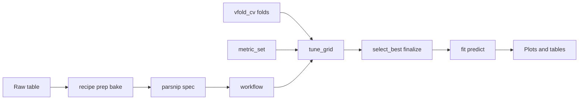

## Learning objectives

- Frame **Breiman's two cultures**: same goals and problems, different **modeling approaches** (not "stats vs ML")
- Build intuition for **decision trees** (`rpart`): recursive splits, partitions, and interpretable rules
- Walk through **gene × disease** (classification) and **gene × trait** (regression) trees step by step
- Read **`|>`** chains for tidy tables and `tidymodels` preprocessing
- Build **`recipe → spec → workflow → tune → fit`** on Palmer Penguins with **`decision_tree` + `rpart`** and **accuracy** on cross-validation

## Navigation

- [Teaching Hub](../index.html)
- [Curriculum Outline](../curriculum-outline.html)
- [Chapter 3  -  Rules and trees](../modules/module-03-trees-and-cultures.html)
- [Chapter 4  -  Modeling workflow](../modules/module-04-pipeline.html)
- [Back: Day 1 (Monday) deck](day-01-monday.html)
- [Next: Day 4 (Thursday) deck](day-04-thursday.html)

# Part A  -  Two cultures and trees {#part-a-cultures}

## Two cultures (Breiman, 2001)

Leo Breiman's [*Statistical Modeling: The Two Cultures*](https://projecteuclid.org/journals/statistical-science/volume-16/issue-3/Statistical-Modeling--The-Two-Cultures/10.1214/ss/1009213726) argues the useful split is **not** "statistics vs machine learning."

- Scientists often share the **same goals** (learn patterns, predict, support decisions) and work on the **same kinds of data**
- What differs is **how you build a model**  -  what you assume up front and what you optimize

## Data modeling culture

- Starts with a **stochastic model** one can write down (Monday: `lm`, `glm`, lasso on known structure)
- Emphasizes **parameters**, uncertainty, and whether the **model class** is adequate
- Strength: transparent assumptions
- Risk: the model may be wrong in shape even when it fits "well"

## Algorithmic modeling culture

- Treat the data-generating mechanism as **largely unknown**
- Let a **flexible algorithm** find structure; judge it by **predictive performance** on data not used to fit 
- Strength: captures interactions and nonlinear boundaries
- Risk: needs **careful evaluation** so flexibility does not fool you on the training data (*overfitting*)

## Decision Trees

Linear models force us to look at the world through straight lines and additive math (`glm`). If two variables interact, we have to manually tell the model to multiply them. Decision trees change that. They naturally capture complex, non-linear relationships by asking a sequence of simple, nested questions.

- Automatic Interactions: Captures non-linear boundaries and complex combinations of variables without you having to manually write out interaction terms.
- Human-Readable Decision Logic: Every prediction can be traced back to a clear, if-then story based on actual measurements.

Today we will implement this splitting logic using the `tidymodels` framework, keeping `rpart` as our underlying engine.

## `rpart` in one slide

### Function call:

- **Classification:** 
`rpart(factor_y ~ ., data = ..., method = "class")`  -  splits improve class purity per cell
- **Regression:** 
`rpart(trait ~ GeneA + GeneB, data = ...)`  -  numeric $y$ uses **`method = "anova"`**; each leaf predicts a **mean** trait

### Tuning parameters (`rpart.control()`)

Set in **`control = rpart.control(cp = ..., minsplit = ..., maxdepth = ...)`**  -  next slide shows the effect of each knob.

## `rpart.control()`: cp, minsplit, maxdepth {#rpart-control-params}

| `rpart.control()` | What it does | Turn it up → |
|---|---|---|
| **`cp`** | Complexity penalty (pruning) | **Simpler** tree (fewer splits) |
| **`minsplit`** | Minimum cases in a node before trying another split | **Fewer** split attempts (coarser tree) |
| **`maxdepth`** | Maximum depth from root to leaf | **Shallower** tree |

**tidymodels names (this afternoon):** `cost_complexity` ≈ `cp`, `min_n` ≈ `minsplit`, `tree_depth` ≈ `maxdepth`.

```{r}
#| label: day02-rpart-params-prep
#| include: false
suppressPackageStartupMessages({
  library(rpart)
  library(rpart.plot)
  library(patchwork)
  library(gridGraphics)
  library(tibble)
})
source("../R/slide-viz-helpers.R")
```

```{r}
#| label: day02-rpart-params-fig
#| echo: false
#| fig-width: 10
#| fig-height: 7.2
#| out-width: 100%
plot_rpart_params_comparison()
```

- Same toy data in every panel  -  only one control changes per row.
- **`cp`:** pruning / cost-complexity trade-off (also tuned via **`$cptable`** later).
- **`minsplit`:** stops splitting when nodes are too small (stability on small $n$).
- **`maxdepth`:** hard cap on how many questions the tree can ask in a row.

# Part B  -  Gene simulations

## Gene × disease (same simulation as Monday)

- Binary **disease** from simulated **gene expression**  -  instructors know causal genes (**Gene1**, **Gene3**, **Gene4**, interaction)
- Classification tree on **all genes**
- Visualized as a tree and in the **Gene1 × Gene3** plane (other genes kept constant at their means)


- Notebook: [logistic-regression-gene-disease.Rmd](../notebooks/logistic-regression-gene-disease.html)

```{r}
#| label: day02-gene-rpart-setup
#| include: false
suppressPackageStartupMessages({
  library(rpart)
  library(rpart.plot)
  library(ggplot2)
  library(rlang)
})
knitr::opts_chunk$set(
  message = FALSE,
  warning = FALSE,
  fig.align = "center",
  out.width = "100%",
  dpi = 120
)
source("../R/slide-viz-helpers.R")

plot_rpart_boundary <- function(
    model,
    data,
    feature1,
    feature2,
    title = NULL,
    split_info = NULL
) {
  r1 <- range(data[[feature1]])
  r2 <- range(data[[feature2]])
  grid <- expand.grid(
    seq(r1[1] - 1, r1[2] + 1, length.out = 180),
    seq(r2[1] - 1, r2[2] + 1, length.out = 180)
  )
  names(grid) <- c(feature1, feature2)
  for (feat in setdiff(names(data), c(feature1, feature2, "disease_presence"))) {
    grid[[feat]] <- mean(data[[feat]])
  }
  grid$response <- predict(model, newdata = grid, type = "class")
  grid$response <- factor(grid$response, levels = c("Absent", "Present"))
  p <- ggplot(data, aes(!!sym(feature1), !!sym(feature2))) +
    geom_tile(
      data = grid,
      aes(!!sym(feature1), !!sym(feature2), fill = response),
      alpha = 0.32,
      inherit.aes = FALSE
    ) +
    geom_point(aes(fill = disease_presence), shape = 21, color = "black", size = 2.2) +
    scale_fill_manual(values = c(Absent = "turquoise", Present = "magenta")) +
    theme_minimal() +
    labs(
      title = title,
      x = feature1,
      y = feature2,
      fill = "Predicted"
    )

  if (!is.null(split_info)) {
    split_lab <- paste0(
      "New split: ", split_info$var, " ", split_info$op, " ",
      signif(split_info$thresh, 3)
    )
    if (split_info$var == feature1) {
      p <- p +
        geom_vline(
          xintercept = split_info$thresh,
          color = "#B71C1C",
          linetype = "dashed",
          linewidth = 1.1
        ) +
        annotate(
          "label",
          x = split_info$thresh,
          y = Inf,
          label = split_lab,
          vjust = 1.15,
          color = "#B71C1C",
          fill = "white",
          size = 3.2,
          label.size = 0.15
        )
    } else if (split_info$var == feature2) {
      p <- p +
        geom_hline(
          yintercept = split_info$thresh,
          color = "#B71C1C",
          linetype = "dashed",
          linewidth = 1.1
        ) +
        annotate(
          "label",
          x = Inf,
          y = split_info$thresh,
          label = split_lab,
          hjust = 1.05,
          color = "#B71C1C",
          fill = "white",
          size = 3.2,
          label.size = 0.15
        )
    } else {
      p <- p +
        annotate(
          "label",
          x = Inf,
          y = -Inf,
          hjust = 1.05,
          vjust = -0.2,
          label = paste0(split_lab, " (not in this 2D slice)"),
          color = "#B71C1C",
          fill = "white",
          size = 3.1,
          label.size = 0.15
        )
    }
  }

  p
}

identify_new_split_node <- function(curr_model, prev_model = NULL) {
  curr_nodes <- rownames(curr_model$frame)
  curr_internal <- curr_nodes[curr_model$frame$var != "<leaf>"]

  if (length(curr_internal) == 0) {
    return(NA_character_)
  }
  if (is.null(prev_model)) {
    return(curr_internal[1])
  }

  prev_nodes <- rownames(prev_model$frame)
  prev_internal <- prev_nodes[prev_model$frame$var != "<leaf>"]
  added_nodes <- setdiff(curr_internal, prev_internal)

  if (length(added_nodes) == 0) {
    revived <- curr_internal[
      curr_model$frame$var[curr_internal] != "<leaf>" &
        prev_model$frame$var[curr_internal] == "<leaf>"
    ]
    if (length(revived) > 0) {
      return(revived[1])
    }
    return(NA_character_)
  }

  added_nodes[1]
}

parse_split_at_node <- function(model, node_id) {
  left_child <- as.numeric(node_id) * 2
  txt <- capture.output(print(model))
  pat <- paste0("^\\s*", left_child, "\\)\\s+(Gene\\d+)([<>]=?)([0-9.eE+-]+)")
  for (ln in txt) {
    m <- regexec(pat, ln)
    hit <- regmatches(ln, m)[[1]]
    if (length(hit) >= 4) {
      return(list(
        node = node_id,
        var = hit[2],
        op = hit[3],
        thresh = as.numeric(hit[4])
      ))
    }
  }
  NULL
}

highlight_tree_cols <- function(model, highlight_node = NA_character_) {
  n <- nrow(model$frame)
  box.col <- rep("#E8F5E9", n)
  border.col <- rep("gray45", n)
  names(box.col) <- rownames(model$frame)
  names(border.col) <- rownames(model$frame)

  if (!is.na(highlight_node) && highlight_node %in% names(box.col)) {
    box.col[highlight_node] <- "#FFD54F"
    border.col[highlight_node] <- "#B71C1C"
  }

  list(box.col = box.col, border.col = border.col)
}

growth_split_info <- function(model, prev_model = NULL) {
  highlight_node <- identify_new_split_node(model, prev_model)
  if (is.na(highlight_node)) {
    return(NULL)
  }
  parse_split_at_node(model, highlight_node)
}

plot_growth_tree <- function(model, nsplit, prev_model = NULL) {
  highlight_node <- identify_new_split_node(model, prev_model)
  cols <- highlight_tree_cols(model, highlight_node)
  par(mar = c(1, 1, 3, 1))
  rpart.plot(
    model,
    type = 4,
    extra = 102,
    box.palette = "BuGn",
    fallen.leaves = TRUE,
    nn = TRUE,
    box.col = cols$box.col,
    border.col = cols$border.col,
    main = paste0("Tree after ", nsplit, " split", ifelse(nsplit == 1, "", "s")),
    sub = if (!is.na(highlight_node)) {
      paste0("Gold box = new split (node ", highlight_node, ")")
    } else {
      ""
    },
    cex = 0.85
  )
  invisible(NULL)
}

describe_new_split <- function(curr_model, prev_model = NULL) {
  highlight_node <- identify_new_split_node(curr_model, prev_model)
  if (is.na(highlight_node)) {
    return("No new split in this step.")
  }

  split_info <- parse_split_at_node(curr_model, highlight_node)
  split_var <- curr_model$frame[highlight_node, "var"]

  if (is.null(split_info)) {
    return(paste0(
      "New split on **", split_var, "** (node ", highlight_node,
      ")  -  highlighted in gold on the tree."
    ))
  }

  paste0(
    "New split on **", split_info$var, "** (node ", highlight_node, "): ",
    split_info$op, " ", signif(split_info$thresh, 3),
    ". Gold box in the tree; dashed line in the partition when the split uses Gene1 or Gene3."
  )
}
```

```{r}
#| label: day02-gene-sim
#| echo: false
#| results: hide
set.seed(123)
n <- 200
p <- 10
gene_names <- paste0("Gene", 1:p)
genes_data <- data.frame(matrix(rnorm(n * p), nrow = n))
colnames(genes_data) <- gene_names
disease_presence <- ifelse(
  0.5 * genes_data$Gene1 + 0.8 * genes_data$Gene3 - 0.3 * genes_data$Gene4 -
    genes_data$Gene1 * genes_data$Gene3 * 2 + rnorm(n, sd = 0.5) > 0,
  1, 0
)
disease_presence <- factor(disease_presence, levels = c(0, 1), labels = c("Absent", "Present"))
bio_data <- data.frame(genes_data, disease_presence)
```

```{r}
#| label: day02-rpart-final
#| echo: false
#| results: hide
rpart_model <- rpart(
  disease_presence ~ .,
  data = bio_data,
  method = "class",
  control = rpart.control(cp = 0.01, minsplit = 10)
)
```


## Final tree (`rpart.plot`)

```{r}
#| label: day02-rpart-final-tree
#| echo: false
#| fig-height: 6
#| fig-width: 8
par(mar = c(1, 1, 3, 1))
rpart.plot(
  rpart_model,
  type = 4,
  extra = 102,
  box.palette = "BuGn",
  fallen.leaves = TRUE,
  main = "Final classification tree (all genes)"
)
```

```{r}
#| label: day02-rpart-step-prep
#| echo: false
#| results: hide
tree_growth_full <- rpart(
  disease_presence ~ .,
  data = bio_data,
  method = "class",
  control = rpart.control(cp = 0, minsplit = 15, maxdepth = 8)
)

cpt <- as.data.frame(tree_growth_full$cptable)
grow_rows <- cpt |>
  dplyr::filter(nsplit > 0) |>
  dplyr::arrange(nsplit)

max_step_splits <- min(4L, nrow(grow_rows))
for (i in seq_len(max_step_splits)) {
  cp_i <- grow_rows$CP[i]
  nsplit_i <- grow_rows$nsplit[i]
  tree_i <- prune(tree_growth_full, cp = cp_i)
  assign(paste0("tree_split_", i), tree_i)
  assign(paste0("tree_nsplit_", i), nsplit_i)
}
```

## Final decision surface (Gene1 vs Gene3)

Other genes fixed at their sample means  -  same 2D slice as Monday's logistic boundary.

```{r}
#| label: day02-rpart-final-boundary
#| echo: false
#| fig-height: 5
#| fig-width: 8
print(
  plot_rpart_boundary(
    rpart_model, bio_data, "Gene1", "Gene3",
    title = "rpart: predicted class in the Gene1-Gene3 plane"
  )
)
```


## Growing the tree (split by split)

Four steps (one new split each): **tree** (left, gold box + node number) and **partition** in Gene1 × Gene3 (right, dashed line when the new split uses those genes).

## Growing the tree: split 1

:::: {.columns}
::: {.column width="50%"}
```{r}
#| label: day02-rpart-step-1-tree
#| echo: false
#| fig-width: 6
#| fig-height: 5.5
#| out-width: 100%
plot_growth_tree(get("tree_split_1"), get("tree_nsplit_1"))
```
:::
::: {.column width="50%"}
```{r}
#| label: day02-rpart-step-1-boundary
#| echo: false
#| fig-width: 6
#| fig-height: 5.5
#| out-width: 100%
print(
  plot_rpart_boundary(
    get("tree_split_1"), bio_data, "Gene1", "Gene3",
    title = "Partition after 1 split",
    split_info = growth_split_info(get("tree_split_1"))
  )
)
```
:::
::::

```{r}
#| label: day02-rpart-step-1-text
#| echo: false
#| results: asis
cat(describe_new_split(get("tree_split_1")), "\n")
```

## Growing the tree: split 2

:::: {.columns}
::: {.column width="50%"}
```{r}
#| label: day02-rpart-step-2-tree
#| echo: false
#| fig-width: 6
#| fig-height: 5.5
#| out-width: 100%
plot_growth_tree(
  get("tree_split_2"), get("tree_nsplit_2"),
  prev_model = get("tree_split_1")
)
```
:::
::: {.column width="50%"}
```{r}
#| label: day02-rpart-step-2-boundary
#| echo: false
#| fig-width: 6
#| fig-height: 5.5
#| out-width: 100%
print(
  plot_rpart_boundary(
    get("tree_split_2"), bio_data, "Gene1", "Gene3",
    title = "Partition after 2 splits",
    split_info = growth_split_info(get("tree_split_2"), get("tree_split_1"))
  )
)
```
:::
::::

```{r}
#| label: day02-rpart-step-2-text
#| echo: false
#| results: asis
cat(describe_new_split(get("tree_split_2"), get("tree_split_1")), "\n")
```

## Growing the tree: split 3

:::: {.columns}
::: {.column width="50%"}
```{r}
#| label: day02-rpart-step-3-tree
#| echo: false
#| fig-width: 6
#| fig-height: 5.5
#| out-width: 100%
plot_growth_tree(
  get("tree_split_3"), get("tree_nsplit_3"),
  prev_model = get("tree_split_2")
)
```
:::
::: {.column width="50%"}
```{r}
#| label: day02-rpart-step-3-boundary
#| echo: false
#| fig-width: 6
#| fig-height: 5.5
#| out-width: 100%
print(
  plot_rpart_boundary(
    get("tree_split_3"), bio_data, "Gene1", "Gene3",
    title = "Partition after 3 splits",
    split_info = growth_split_info(get("tree_split_3"), get("tree_split_2"))
  )
)
```
:::
::::

```{r}
#| label: day02-rpart-step-3-text
#| echo: false
#| results: asis
cat(describe_new_split(get("tree_split_3"), get("tree_split_2")), "\n")
```

## Growing the tree: split 4

:::: {.columns}
::: {.column width="50%"}
```{r}
#| label: day02-rpart-step-4-tree
#| echo: false
#| fig-width: 6
#| fig-height: 5.5
#| out-width: 100%
plot_growth_tree(
  get("tree_split_4"), get("tree_nsplit_4"),
  prev_model = get("tree_split_3")
)
```
:::
::: {.column width="50%"}
```{r}
#| label: day02-rpart-step-4-boundary
#| echo: false
#| fig-width: 6
#| fig-height: 5.5
#| out-width: 100%
print(
  plot_rpart_boundary(
    get("tree_split_4"), bio_data, "Gene1", "Gene3",
    title = "Partition after 4 splits",
    split_info = growth_split_info(get("tree_split_4"), get("tree_split_3"))
  )
)
```
:::
::::

```{r}
#| label: day02-rpart-step-4-text
#| echo: false
#| results: asis
cat(describe_new_split(get("tree_split_4"), get("tree_split_3")), "\n")
```


## Tree vs logistic (same data, in-sample accuracy)

```{r}
#| label: day02-rpart-accuracy
#| echo: false
#| results: asis
logistic_model <- glm(disease_presence ~ ., data = bio_data, family = binomial())
log_prob <- predict(logistic_model, type = "response")
log_pred <- factor(
  ifelse(log_prob > 0.5, "Present", "Absent"),
  levels = c("Absent", "Present")
)
rpart_pred <- predict(rpart_model, type = "class")
knitr::kable(
  data.frame(
    Model = c("Logistic (glm)", "Decision tree (rpart)"),
    Accuracy_in = c(
      mean(log_pred == bio_data$disease_presence),
      mean(rpart_pred == bio_data$disease_presence)
    )
  ),
  digits = 3,
  caption = "In-sample accuracy on all n rows (Monday vs Tuesday model class)"
)
```

## Tree vs logistic  -  boundaries side by side

Same **Gene1 × Gene3** slice; other genes at their means.

:::: {.columns}
::: {.column width="50%"}
```{r}
#| label: day02-logistic-boundary-compare
#| echo: false
#| fig-width: 6
#| fig-height: 5
print(
  plot_glm_logistic_boundary(
    logistic_model, bio_data, "Gene1", "Gene3", "disease_presence",
    title = "Logistic (glm)"
  )
)
```
:::
::: {.column width="50%"}
```{r}
#| label: day02-tree-boundary-compare
#| echo: false
#| fig-width: 6
#| fig-height: 5
print(
  plot_rpart_boundary(
    rpart_model, bio_data, "Gene1", "Gene3",
    title = "Decision tree (rpart)"
  )
)
```
:::
::::


## Gene × trait (Monday simulation, regression tree)

- Continuous **trait** from **GeneA** / **GeneB**  -  same ground truth as Monday's `lm` / lasso block
- **`rpart(trait ~ GeneA + GeneB, cp = ...)`**  -  sweep **`cp`** from `$cptable` to show how the predicted **surface** and tree change
- Notebook: [linear-regression-lasso.Rmd](../notebooks/linear-regression-lasso.html)

**Gene × trait  -  regression trees (`rpart`)** on the same simulation as Monday ([linear-regression-lasso.Rmd](../notebooks/linear-regression-lasso.html)): continuous **trait** from **GeneA** and **GeneB**.

```{r}
#| label: day02-trait-rpart-setup
#| include: false
plot_trait_surface <- function(model, data, title = NULL) {
  geneA_values <- seq(-3.5, 3.5, length.out = 100)
  geneB_values <- seq(-3.5, 3.5, length.out = 100)
  grid_data <- expand.grid(GeneA = geneA_values, GeneB = geneB_values)
  grid_data$Predicted <- as.numeric(predict(model, newdata = grid_data))
  ggplot() +
    geom_raster(
      data = grid_data,
      aes(x = GeneA, y = GeneB, fill = Predicted),
      interpolate = TRUE
    ) +
    geom_point(
      data = data,
      aes(x = GeneA, y = GeneB),
      size = 3,
      inherit.aes = FALSE,
      color = "black"
    ) +
    geom_point(
      data = data,
      aes(x = GeneA, y = GeneB, fill = trait),
      size = 2.8,
      inherit.aes = FALSE,
      shape = 21,
      color = "black"
    )+
    scale_fill_gradient(
      low = "turquoise",
      high = "magenta",
      name = "Predicted trait"
    ) +
    scale_color_gradient(
      low = "turquoise",
      high = "magenta",
      name = "Observed trait"
    ) +
    theme_minimal() +
    labs(title = title, x = "Gene A", y = "Gene B")
}

save_trait_composite <- function(model, cp, chunk_id) {
  path <- paste0(knitr::fig_chunk(chunk_id), ".png")
  dir.create(dirname(path), recursive = TRUE, showWarnings = FALSE)
  if (requireNamespace("ragg", quietly = TRUE)) {
    ragg::agg_png(path, width = 12, height = 6, units = "in", res = 120)
  } else {
    png(path, width = 12, height = 6, units = "in", res = 120)
  }
  on.exit(dev.off(), add = TRUE)
  layout(matrix(1:2, nrow = 1, ncol = 2))
  par(mar = c(1, 1, 3, 1))
  rpart.plot(
    model,
    type = 4,
    extra = 101,
    box.palette = "BuGn",
    fallen.leaves = TRUE,
    main = paste0("Regression tree (cp = ", signif(cp, 3), ")"),
    cex = 0.85
  )
  print(
    plot_trait_surface(
      model,
      X_train,
      title = "Predicted trait in the GeneA × GeneB plane"
    )
  )
  path
}

describe_trait_cp <- function(model, cp) {
  n_split <- max(0L, nrow(model$frame) - 1L)
  paste0(
    "**cp = ", signif(cp, 3), "**  -  ", n_split, " split",
    if (n_split == 1L) "" else "s",
    ". Each region predicts a **constant** trait (piecewise average); ",
    "background colour is the model's prediction on a grid."
  )
}
```

```{r}
#| label: day02-trait-sim
#| echo: false
#| results: hide
set.seed(123)
n <- 150
gene_names <- c("GeneA", "GeneB", "GeneC", "GeneD", "GeneE", "GeneF", "GeneG", "GeneH", "GeneI", "GeneJ")
gene_data <- matrix(rnorm(n * length(gene_names)), nrow = n)
colnames(gene_data) <- gene_names
trait <- -0.5 * gene_data[, "GeneA"] + 0.8 * gene_data[, "GeneB"] + rnorm(n, sd = 0.3)
gene_data[, "GeneC"] <- gene_data[, "GeneA"] + rnorm(n, sd = 0.2)
gene_data[, "GeneD"] <- -0.3 * gene_data[, "GeneB"] + rnorm(n, sd = 0.2)
gene_data[, "GeneJ"] <- 0.7 * gene_data[, "GeneA"] + rnorm(n, sd = 0.2)
data_trait <- as.data.frame(cbind(gene_data, trait))
X_train <- data_trait[, c("GeneA", "GeneB", "trait")]
```

```{r}
#| label: day02-trait-cp-prep
#| echo: false
#| results: hide
trait_fit0 <- rpart(trait ~ GeneA + GeneB, data = X_train)
cps_all <- trait_fit0$cptable[, "CP"]
cps_all <- cps_all[-1]
if (length(cps_all) == 0L) {
  cps_all <- 0.01
}
n_trait_show <- min(4L, length(cps_all))
idx <- unique(round(seq(1, length(cps_all), length.out = n_trait_show)))
trait_cps <- cps_all[idx]
while (length(trait_cps) < 4L) {
  trait_cps <- c(trait_cps, tail(trait_cps, 1))
}
trait_cps <- trait_cps[1:4]
for (i in seq_along(trait_cps)) {
  cp_i <- trait_cps[i]
  tree_i <- rpart(trait ~ GeneA + GeneB, data = X_train, cp = cp_i)
  assign(paste0("trait_tree_", i), tree_i)
  assign(paste0("trait_cp_", i), cp_i)
}
```

## Gene × trait (continuous outcome)

- Same story as **Monday**: trait = $-0.5 \times$ **GeneA** $+ 0.8 \times$ **GeneB** + noise (linear truth)
- **`rpart(trait ~ GeneA + GeneB, ...)`**  -  default **`method = "anova"`** for a numeric $y$ (splits minimize within-node variance)
- Contrast with disease block: **`method = "class"`** for a factor outcome
- Notebook loop over **`cp`** values: [linear-regression-lasso.Rmd](../notebooks/linear-regression-lasso.html)

## Complexity penalty `cp` (pruning)

- Fit a **large** tree first; **`cp`** in `rpart(..., cp = ...)` keeps splits only if they improve the fit enough relative to tree size
- **`$cptable`** lists candidate **`cp`** values (we skip the first row, as in the notebook)
- **Larger `cp`** → **simpler** tree (fewer splits); **smaller `cp`** → more regions, smoother mosaic of predicted trait

## Trait tree: step 1 of 4

```{r}
#| label: day02-rpart-trait-1-fig
#| echo: false
#| fig-width: 10
#| fig-height: 5
#| out-width: 100%
knitr::include_graphics(save_trait_composite(get("trait_tree_1"), get("trait_cp_1"), "day02-rpart-trait-1-fig"))
```

```{r}
#| label: day02-rpart-trait-1-text
#| echo: false
#| results: asis
cat(describe_trait_cp(get("trait_tree_1"), get("trait_cp_1")), "\n")
```

## Trait tree: step 2 of 4

```{r}
#| label: day02-rpart-trait-2-fig
#| echo: false
#| fig-width: 10
#| fig-height: 5
#| out-width: 100%
knitr::include_graphics(save_trait_composite(get("trait_tree_2"), get("trait_cp_2"), "day02-rpart-trait-2-fig"))
```

```{r}
#| label: day02-rpart-trait-2-text
#| echo: false
#| results: asis
cat(describe_trait_cp(get("trait_tree_2"), get("trait_cp_2")), "\n")
```

## Trait tree: step 3 of 4

```{r}
#| label: day02-rpart-trait-3-fig
#| echo: false
#| fig-width: 10
#| fig-height: 5
#| out-width: 100%
knitr::include_graphics(save_trait_composite(get("trait_tree_3"), get("trait_cp_3"), "day02-rpart-trait-3-fig"))
```

```{r}
#| label: day02-rpart-trait-3-text
#| echo: false
#| results: asis
cat(describe_trait_cp(get("trait_tree_3"), get("trait_cp_3")), "\n")
```

## Trait tree: step 4 of 4

```{r}
#| label: day02-rpart-trait-4-fig
#| echo: false
#| fig-width: 10
#| fig-height: 5
#| out-width: 100%
knitr::include_graphics(save_trait_composite(get("trait_tree_4"), get("trait_cp_4"), "day02-rpart-trait-4-fig"))
```

```{r}
#| label: day02-rpart-trait-4-text
#| echo: false
#| results: asis
cat(describe_trait_cp(get("trait_tree_4"), get("trait_cp_4")), "\n")
```

## Trait: tree vs linear (in-sample RMSE)

```{r}
#| label: day02-rpart-trait-rmse
#| echo: false
#| results: asis
lm_ab <- lm(trait ~ GeneA + GeneB, data = X_train)
pred_lm <- predict(lm_ab, newdata = X_train)
pred_tree <- predict(get(paste0("trait_tree_", length(trait_cps))), newdata = X_train)
rmse <- function(y, yhat) sqrt(mean((y - yhat)^2))
knitr::kable(
  data.frame(
    Model = c("Linear (GeneA + GeneB)", paste0("rpart (cp = ", signif(tail(trait_cps, 1), 3), ")")),
    RMSE_in = c(rmse(X_train$trait, pred_lm), rmse(X_train$trait, pred_tree))
  ),
  digits = 3,
  caption = "In-sample RMSE on all n rows  -  same genes as Monday's simple linear model"
)
```


# Part C  -  Palmer Penguins: tidymodels pipeline (trees only) {#part-c-pipeline}

**Computing reference:** [Applied Machine Learning for Tabular Data — tidymodels supplement](https://tidymodels.aml4td.org/)

## Meet the Palmer penguins

Real data for the rest of Tuesday and again on **Thursday**: bill measurements, species labels, and honest evaluation.

{width=75% fig-align="center"}

*Artwork: Allison Horst / Palmer Penguins LTER study (teaching use).*

## From manual `rpart` to a reusable pipeline

- Monday compared models **on all rows**; today we **hold out** information via **cross-validation** while tuning
- **One workflow** runs preprocessing + tree on each fold  -  same discipline as the microbiome lab this afternoon
- Dataset: [Palmer Penguins data card](../data/cards/palmer-penguins.html)  -  Adelie vs Gentoo; **bill + island + sex + year**

Short **tidyverse** refresher before the `tidymodels` pipeline (same pipe grammar as recipes and workflows).

```{r}
#| label: day02-tidy-intro-setup
#| include: false
suppressPackageStartupMessages(library(tidyverse))
knitr::opts_chunk$set(message = FALSE, warning = FALSE)
```

## Tidy data and the pipe `|>`

- Each **column** is one variable; each **row** is one penguin (or one sample)
- **`x |> f()`** means: take the result of `x` and pass it as the **first argument** to `f()`
- Read chains **top to bottom**  -  same habit you will use for `recipe() |> step_*()`

## Example: `filter` and `select`

```{r}
#| label: day02-tidy-filter-select
#| echo: true
pg <- palmerpenguins::penguins |>
  filter(!is.na(sex), !is.na(bill_length_mm), !is.na(bill_depth_mm)) |>
  select(species, island, sex, bill_length_mm, bill_depth_mm, body_mass_g)

head(pg, 4)
```

## Example: `mutate` (new columns)

```{r}
#| label: day02-tidy-mutate
#| echo: true
pg |>
  mutate(bill_ratio = bill_length_mm / bill_depth_mm) |>
  select(species, bill_length_mm, bill_depth_mm, bill_ratio) |>
  head(4)
```

## Same grammar in `tidymodels`

- **Table pipelines:** `penguins |> filter(...) |> mutate(...)`
- **Preprocessing:** `recipe(y ~ ., data = train) |> step_dummy() |> step_normalize()`
- **Modeling objects:** `workflow() |> add_recipe(rec) |> add_model(spec)`  -  here you chain **objects**, not tables, but the **read left-to-right** habit is the same

```{r}
#| label: day02-penguins-setup
#| include: false
suppressPackageStartupMessages({
  library(tidymodels)
  library(palmerpenguins)
  library(dplyr)
  library(tidyr)
  library(ggplot2)
  library(rlang)
  library(vip)
  library(rpart.plot)
})
knitr::opts_chunk$set(
  message = FALSE,
  warning = FALSE,
  fig.align = "center",
  out.width = "100%",
  dpi = 120
)
if (file.exists("../R/slide-viz-helpers.R")) {
  source("../R/slide-viz-helpers.R")
}

peng_cls <- palmerpenguins::penguins |>
  filter(species %in% c("Adelie", "Gentoo")) |>
  mutate(
    y = factor(species, levels = c("Adelie", "Gentoo")),
    year = as.numeric(year)
  ) |>
  dplyr::select(-species, -flipper_length_mm, -body_mass_g) |>
  tidyr::drop_na()

peng_bal <- peng_cls
folds <- vfold_cv(peng_cls, v = 5, strata = y)
metrics_day2 <- metric_set(accuracy)

plot_class_balance <- function(df, title = "Class counts") {
  ggplot(df, aes(y, fill = y)) +
    geom_bar(show.legend = FALSE) +
    geom_text(stat = "count", aes(label = after_stat(count)), vjust = -0.3, size = 4) +
    scale_fill_manual(values = c(Adelie = "turquoise", Gentoo = "magenta")) +
    theme_minimal() +
    labs(title = title, x = "Species (y)", y = "n")
}

plot_prob_boundary <- function(
    model,
    data,
    f1 = "bill_length_mm",
    f2 = "bill_depth_mm",
    title = NULL
) {
  r1 <- range(data[[f1]], na.rm = TRUE)
  r2 <- range(data[[f2]], na.rm = TRUE)
  grid <- expand.grid(
    seq(r1[1] - 0.5, r1[2] + 0.5, length.out = 120),
    seq(r2[1] - 0.5, r2[2] + 0.5, length.out = 120)
  )
  names(grid) <- c(f1, f2)
  for (nm in setdiff(names(data), c(f1, f2, "y"))) {
    v <- data[[nm]]
    grid[[nm]] <- if (is.numeric(v)) stats::median(v, na.rm = TRUE) else {
      tab <- table(v)
      names(tab)[which.max(tab)]
    }
  }
  grid$prob <- predict(model, new_data = grid, type = "prob")$.pred_Gentoo
  ggplot(data, aes(!!sym(f1), !!sym(f2))) +
    geom_raster(
      data = grid,
      aes(!!sym(f1), !!sym(f2), fill = prob),
      interpolate = TRUE,
      inherit.aes = FALSE
    ) +
    geom_point(aes(color = y), size = 2.2) +
    scale_fill_gradient(low = "turquoise", high = "magenta", name = "P(Gentoo)") +
    scale_color_manual(values = c(Adelie = "black", Gentoo = "white"), name = "Species") +
    theme_minimal() +
    labs(title = title, x = f1, y = f2)
}

metrics_summary_table <- function(fit_res, label) {
  collect_metrics(fit_res) |>
    dplyr::filter(.metric == "accuracy") |>
    dplyr::select(.metric, mean, std_err) |>
    dplyr::mutate(model = label) |>
    dplyr::relocate(model)
}
```

## Palmer Penguins: one table, one model family (trees)

- **Outcome `y`:** Adelie vs Gentoo (complete cases).
- **Predictors:** bill length & depth, **island**, **sex**, **year**  -  no flipper or body mass (so **`tree_depth`** and **`min_n`** show a real tuning tradeoff).
- **Today's engine:** **`decision_tree()` + `rpart` only**  -  forests and boosting come on **Thursday**.

```{r}
#| label: day02-walk-balance
#| echo: false
#| fig-width: 7
#| fig-height: 4
plot_class_balance(peng_bal, "Balanced classes")
```

```{r}
#| label: day02-walk-scatter
#| echo: false
#| fig-width: 7
#| fig-height: 4.5
ggplot(peng_bal, aes(bill_length_mm, bill_depth_mm, color = y)) +
  geom_point(size = 2.6) +
  scale_color_manual(values = c(Adelie = "turquoise", Gentoo = "magenta")) +
  theme_minimal() +
  labs(
    title = "Bill space  -  Adelie vs Gentoo",
    x = "Bill length (mm)",
    y = "Bill depth (mm)"
  )
```

## The pipeline in principle

No code yet  -  the **shape** of every `tidymodels` project this week:



- **Recipe steps run inside each CV fold**  -  never scale or encode on the full table before splitting (avoids leakage).
- **`recipe` / `spec` / `workflow` are blueprints**; only **`fit()`**, **`fit_resamples()`**, and **`tune_grid()`** touch rows.
- **Today's score:** **accuracy** only; Thursday adds metrics for imbalanced data.

## Five steps  -  what each one does

1. **Recipe**  -  declare preprocessing steps (drop useless columns, dummy-code categories, scale numerics). **`prep()`** learns rules on training rows; **`bake()`** applies them.
2. **Spec**  -  choose model **type**, **engine**, **mode**, and which arguments to tune. Still a **blueprint**  -  not fitted.
3. **Workflow**  -  glue **`recipe` + `spec`** so one **`fit()`** runs preprocessing and training in the right order.
4. **Metrics**  -  define how to judge predictions (**`accuracy`** today).
5. **Resample and tune**  -  search hyperparameters on **`vfold_cv`** folds, pick the best, then **`fit`** for plots and interpretation.

## Packages in the pipeline (Tuesday focus)

| Package | Job today |
|---------|-----------|
| **`recipes`** | Preprocessing checklist (dummy, scale, ...) |
| **`parsnip`** | Model blueprint (`decision_tree`, `set_engine("rpart")`) |
| **`workflows`** | Glue recipe + model |
| **`rsample`** | Folds (`vfold_cv`)  -  used in Step 5 |
| **`tune`** | Search `tree_depth` and `min_n` |
| **`yardstick`** | **`accuracy`** scoring |

# Step 1  -  Preprocessing (`recipe`)

Turn raw columns into a model-ready table  -  **in order**, and **only on training rows** inside each fold.

## Step 1  -  Why a recipe?

- A **recipe** is a **checklist** of transforms applied **before** the model sees the data.
- Steps run **top to bottom**; order matters (e.g. dummy-code before scaling).
- **`prep()`** learns parameters on **training rows**; **`bake()`** applies those rules to new rows **without re-learning**.
- A **`workflow()`** runs **`prep` + `bake` + `fit`** in the right order inside each CV fold.

## Start the recipe

```{r}
#| label: day02-walk-rec-start
#| echo: true
#| message: false
rec <- recipe(y ~ ., data = peng_bal)
rec
```

- **`recipe(y ~ ., data = peng_bal)`**  -  `y` is the outcome; **`.`** = all other columns are predictors.
- Blueprint only  -  nothing transformed yet.

## `step_zv()`  -  drop zero-variance columns

```{r}
#| label: day02-walk-rec-zv
#| echo: true
#| message: false
rec <- rec |>
  step_zv(all_predictors())
rec
```

- Removes columns with one unique value (no predictive power; can break algorithms in small folds).

## `step_dummy()`  -  encode categories

```{r}
#| label: day02-walk-rec-dummy
#| echo: true
#| message: false
rec <- rec |>
  step_dummy(all_nominal_predictors())
rec
```

- **`island`** and **`sex`** → numeric 0/1 columns for **`rpart`**.

## `step_normalize()`  -  scale numeric predictors

```{r}
#| label: day02-walk-rec-norm
#| echo: true
#| message: false
rec <- rec |>
  step_normalize(all_numeric_predictors())
rec
```

- Z-score each numeric column using **training-fold rows only** inside CV.
- Good habit before you swap in other model types later in the week.

```{r}
#| label: day02-walk-rec-base-assign
#| echo: true
#| message: false
rec_base <- rec
rec_base
```

## `prep()` and `bake()` — learn rules, then apply {#prep-and-bake}

- **`prep(recipe, training = train)`** estimates each step on **training rows only** (means for scaling, dummy levels, etc.).
- **`bake(prep, new_data = ...)`** applies those rules to any table (train, test, or one new penguin) **without re-learning**.
- A **`workflow()`** calls **`prep` + `bake` + `fit`** in the right order inside each CV fold  -  you rarely call them by hand except for checks and tools like **SHAP** (Thursday).

```{r}
#| label: day02-walk-prep-bake-demo
#| echo: true
#| message: false
set.seed(2)
split_demo <- initial_split(peng_bal, prop = 0.75, strata = y)
train_demo <- training(split_demo)
test_demo <- testing(split_demo)

rec_prep <- prep(rec_base, training = train_demo)
bake_train <- bake(rec_prep, new_data = train_demo)
bake_test <- bake(rec_prep, new_data = test_demo)

dplyr::glimpse(bake_train)
```

- **`bake_train`**: model-ready columns the tree sees during **`fit()`**.
- **`bake_test`**: same encoding using **training** statistics  -  that is what prevents leakage.

## Afternoon lab — Task 2.1



# Step 2  -  Model blueprint (`spec`)

Choose the learner and its settings  -  still **no fitting**.

## Step 2  -  What is a spec?

- **`parsnip`** stores the **model family** and hyperparameters in a **`spec`** object.
- **`set_engine("rpart")`** picks the R implementation; **`set_mode("classification")`** matches a factor outcome.
- **`tune()`** marks arguments we will search later  -  the spec stays a **blueprint** until **`fit()`**.

## Classification tree with `rpart`

```{r}
#| label: day02-walk-tree-spec-fixed
#| echo: true
#| message: false
tree_spec_demo <- decision_tree(tree_depth = 4, min_n = 10) |>
  set_engine("rpart") |>
  set_mode("classification")
tree_spec_demo
```

- **`decision_tree()`**  -  fixed **parsnip** function name.
- **`tree_depth`**, **`min_n`**  -  depth limit and minimum leaf size.
- **`set_engine("rpart")`**  -  same engine as the gene trees this morning.
- **`set_mode("classification")`**  -  factor outcome **`y`**.

## Afternoon lab — Task 2.2



## Tuning knobs (`tune()`)

```{r}
#| label: day02-walk-tree-spec-tune
#| echo: true
#| message: false
tree_spec <- decision_tree(
  tree_depth = tune(),
  min_n = tune()
) |>
  set_engine("rpart") |>
  set_mode("classification")
tree_spec
```

- **`tune()`** marks arguments **`tune_grid()`** will search  -  we pick winners by **cross-validated accuracy**.

## Parsnip: type → engine → mode

| Model type | Valid engines (examples) | Modes |
|------------|--------------------------|-------|
| `decision_tree()` | `"rpart"`, `"C5.0"` | classification, regression |
| `rand_forest()` | `"ranger"`, `"randomForest"` | classification, regression |
| `boost_tree()` | `"xgboost"`, `"lightgbm"` | classification, regression |

Thursday swaps **`spec`**  -  same **`recipe`** and **`workflow()`** pattern.

```{r}
#| label: day02-walk-bad-engine
#| echo: true
#| eval: false
#| message: false
decision_tree() |>
  set_engine("lm") |>
  set_mode("classification")
# Error: 'lm' is not a valid engine for decision_tree()
```

# Step 3  -  Workflow

Bundle preprocessing and model into **one** object.

## Step 3  -  Bundle recipe and model

- **`workflow()`** combines **`rec_base`** and **`tree_spec`** so you never preprocess the full table before splitting.
- **`add_recipe()`** + **`add_model()`**  -  one object to pass to **`fit()`**, **`tune_grid()`**, or **`fit_resamples()`**.
- Inside each resample, the workflow **prep → bake → train** on analysis rows only.

## Step 3  -  `workflow()` code

```{r}
#| label: day02-walk-wf
#| echo: true
#| message: false
wf <- workflow() |>
  add_recipe(rec_base) |>
  add_model(tree_spec)
wf
```

## Step 3  -  One-shot fit (intuition)

::: {.callout-warning}
## For visualization only

**`fit(wf, data = peng_bal)`** on **all rows** helps us **see** a boundary. For honest reporting, keep a locked test set (or use CV metrics from Step 5).
:::

- **`fit(wf, data = peng_bal)`** on **all rows** is a quick way to **see** a decision boundary  -  not our final honest evaluation.
- We use a **fixed** demo spec (`tree_spec_demo`) so the plot is stable before tuning.
- After tuning (Step 5), we refit on all rows for teaching plots; in a project, keep a locked **test** set.

## Step 3  -  Fit and boundary (code)

```{r}
#| label: day02-walk-fit-demo
#| echo: true
#| message: false
wf_demo <- workflow() |>
  add_recipe(rec_base) |>
  add_model(tree_spec_demo)
fit_demo <- fit(wf_demo, data = peng_bal)
```

```{r}
#| label: day02-walk-boundary
#| echo: false
#| fig-width: 9
#| fig-height: 6
#| out-width: 100%
print(plot_prob_boundary(fit_demo, peng_bal, title = "Fitted tree  -  P(Gentoo)"))
```

## Afternoon lab — Task 2.3



## Logistic boundary on penguins (same bill plane)

A **smooth** linear boundary from **`logistic_reg()`**  -  contrast with the **rectangular** tree regions above.

```{r}
#| label: day02-walk-glm-boundary
#| echo: false
#| fig-width: 9
#| fig-height: 6
#| out-width: 100%
glm_spec_demo <- logistic_reg() |>
  set_engine("glm") |>
  set_mode("classification")
wf_glm_demo <- workflow() |>
  add_recipe(rec_base) |>
  add_model(glm_spec_demo)
fit_glm_demo <- fit(wf_glm_demo, peng_bal)
print(
  plot_workflow_prob_boundary(
    fit_glm_demo, peng_bal, "bill_length_mm", "bill_depth_mm",
    title = "Logistic regression  -  P(Gentoo) in bill space"
  )
)
```

## Afternoon lab — Task 2.4



# Step 4  -  Metrics 

Decide **how** to score predictions **before** you tune.

## Step 4  -  Choose a metric before tuning

- Today we use **`accuracy`**  -  fraction of correct class labels; fine when classes are balanced and errors cost the same.
- **Thursday:** we will add sensitivity, ROC-AUC, PR-AUC when the positive class is rare  -  accuracy can mislead.
- **`metric_set(accuracy)`** bundles scorers for **`tune_grid()`** and **`fit_resamples()`**.

## Step 4  -  `metric_set` code

```{r}
#| label: day02-walk-metrics
#| echo: true
#| message: false
metrics_day2
```

## Afternoon lab — Task 2.5



# Step 5  -  Cross-validation and tuning

Search **`tree_depth`** and **`min_n`** on held-out folds, then finalize.

## `fit()` vs `fit_resamples()` vs `tune_grid()`

| Function | Data splits | Parameter combinations |
|----------|-------------|------------------------|
| **`fit()`** | 1 training set | 1 |
| **`fit_resamples()`** | Many folds/resamples | 1 |
| **`tune_grid()`** | Many folds/resamples | Many |

- Use **`fit()`** when hyperparameters are already chosen.
- Use **`fit_resamples()`** to estimate CV performance for one fixed workflow.
- Use **`tune_grid()`** when you need to search over multiple hyperparameter values.

**In this deck:** `fit_demo` (one fit for plotting), `rs_tree` (CV with fixed tuned params), `tune_res` (CV + hyperparameter search).

## Step 5  -  Search hyperparameters on folds

- **`folds <- vfold_cv(..., strata = y)`**  -  each fold keeps both species represented.
- **`tune_grid(wf, resamples = folds, grid = ..., metrics = metrics_day2)`** tries many specs; preprocessing is refit **inside** each fold.
- Grid spans **stumps** (depth 1, large `min_n`) to **more flexible** trees.

## Step 5  -  `tune_grid` code

```{r}
#| label: day02-walk-tune
#| echo: true
#| message: false
set.seed(2)
tune_res <- tune_grid(
  wf,
  resamples = folds,
  grid = grid_regular(
    tree_depth(range = c(1, 6)),
    min_n(range = c(2, 50)),
    levels = 4
  ),
  metrics = metrics_day2
)
```

## Step 5  -  Read the tuning plot

- **`autoplot(tune_res)`** shows mean **accuracy** vs **`tree_depth`** and **`min_n`**.
- Expect **lower accuracy** at **`tree_depth = 1`** (stump) and with **large `min_n`** (heavy pruning).
- Pick a region that balances fit and simplicity before **`select_best()`**.

## Step 5  -  Tuning plot (code)

```{r}
#| label: day02-walk-autoplot
#| echo: true
#| fig-width: 10
#| fig-height: 5
tune_res |>
  autoplot() +
  theme_minimal() +
  labs(
    title = "Tuning: accuracy vs tree_depth and min_n",
    subtitle = "Bill + island + sex + year  -  no flipper/mass"
  )
```



## Step 5  -  Finalize and refit

- **`select_best(tune_res, metric = "accuracy")`**  -  best hyperparameters from CV.
- **`finalize_workflow(wf, best)`**  -  plug tuned values into the blueprint.
- **`fit(final_wf, data = peng_cls)`**  -  one tree on all rows for **plots**; **`fit_resamples()`** reports honest CV performance.
- In projects, use **`last_fit()`** with a true test set instead of fitting on all rows for reporting.

## Step 5  -  Finalize and CV metrics (code)

```{r}
#| label: day02-walk-finalize
#| echo: true
#| message: false
best <- select_best(tune_res, metric = "accuracy")
final_wf <- finalize_workflow(wf, best)
final_fit <- fit(final_wf, data = peng_cls)
best
```

```{r}
#| label: day02-walk-fit-resamples
#| echo: true
#| message: false
set.seed(6)
wf_tree <- final_wf
rs_tree <- fit_resamples(wf_tree, folds, metrics = metrics_day2)
metrics_summary_table(rs_tree, "Tuned tree (5-fold CV)")
```

## Fitted tree structure

```{r}
#| label: day02-walk-rpart-plot
#| echo: true
#| fig-width: 10
#| fig-height: 6
final_fit |>
  extract_fit_engine() |>
  rpart.plot(
    roundint = FALSE,
    type = 4,
    extra = 104,
    box.palette = "RdBu",
    main = "Final decision tree (rpart)"
  )
```

## Variable importance (this tree)

```{r}
#| label: day02-walk-vip
#| echo: true
#| fig-width: 9
#| fig-height: 5
final_fit |>
  extract_fit_parsnip() |>
  vip(geom = "point", aesthetics = list(color = "midnightblue", size = 3)) +
  theme_minimal() +
  labs(
    title = "Split-based importance (single tree)",
    subtitle = "Correlated bills ≠ causation  -  full VIP chapter on Thursday"
  )
```

# Part D  -  Wrap-up {#part-d-wrapup}

## Transition to Day 4 (Thursday)

- You have **`rec_base`**, **`workflow()`**, **`vfold_cv`**, and **`tune_grid`** with a **tree**
- Thursday: **same recipe**  -  swap in forests, boosting, neural nets; add PCA, imputation, imbalance; **richer metrics** and VIP

## End-of-day checklist

- Can you name Breiman's **two cultures** in one sentence each?
- For the gene **classification** tree: what does **one split** do to the Gene1-Gene3 partition?
- For the gene **trait** tree: what does a larger **`cp`** do to the number of regions?
- What is the difference between **training**, **CV**, and **test** rows in the penguin workflow?
- Which three objects does **`workflow()`** bundle?
